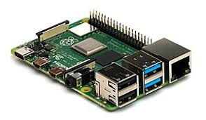
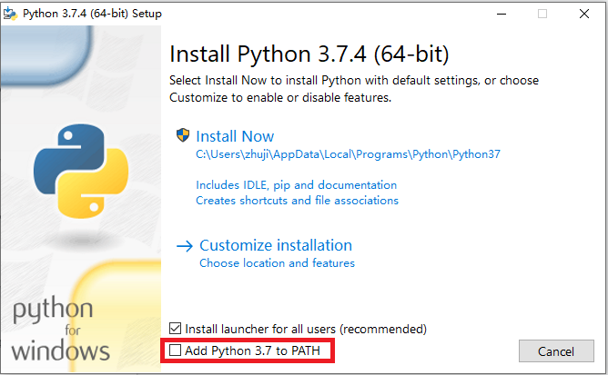
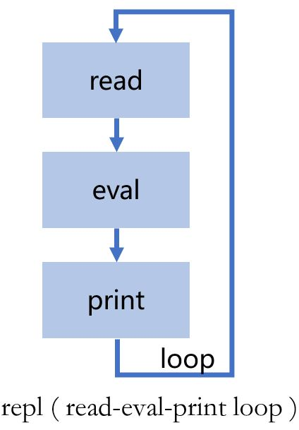

# 运行Python程序

## 环境基础
- Linux

  

  树莓派系统的安装：[《HomeAssistant智能家居实战篇》](https://study.163.com/course/courseMain.htm?courseId=1006189053&share=2&shareId=400000000624093)之[《硬件环境准备——安装树莓派》](https://study.163.com/course/courseLearn.htm?courseId=1006189053&share=2&shareId=400000000624093#/learn/video?lessonId=1053672861&courseId=1006189053)

  安装Python环境：`sudo apt-get install python3 python3-dev python3-pip`

- Windows与MacOS

  [Python下载页面](https://www.python.org/downloads/)

  

## REPL


- 运行`python`进入REPL
- 手工尝试sorted函数的用法
- 程序段的写法
- `eval()`函数的用法

## 运行python文件
```python
#! /usr/bin/python3

sum = 0
for i in range(101):
  sum = sum + i

print("The sum of [1,...,100] is: ")
print(sum)
```

- 第一种运行方式

  `python 文件名`

- 第二种运行方式

  文件首行增加执行程序：`#! /usr/bin/python`

  增加文件可执行属性：`chmod +x 文件名`：

  *注：在Windows下编辑完python文件即可直接运行（只要后缀名为.py)*

- 第三种方式（在Python程序中运行）
```python
import os
os.system('./test.py')
```

- 第四种方式（在Python程序中运行）
```python
import test

import sys
del sys.modules['test']
```
## 核心词汇
- `REPL`

  read-eval-print loop

- `eval`

  求值

- `loop`

  循环

- `import`

  引入

- `raspberry Pi`

  树莓派

- `python`

  蟒蛇
  
  

