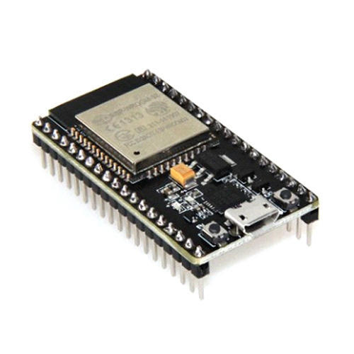

# 单片机上的Python——MicroPython

难度：★★★☆☆

## 什么是单片机？

- NodeMCU 32s



## 单片机上的MicroPython
- 支持pyboard、esp8266、esp32、stm32等单片机
- 基于Python3，支持大多数的标准库，仅有细微的差别
- 拥有支持底层硬件操作的各种库

[MicroPython官方文档](http://docs.micropython.org/en/latest/index.html)

[CircuitPython](https://github.com/adafruit/circuitpython)

## 安装MicroPython
- 下载对应的固件

  [MicroPython下载地址](http://micropython.org/download)

- 安装esptool工具

  `pip install esptool`

- 烧录固件
    + 擦除

      `esptool.py --port COMx erase_flash`

    + 写入

      `esptool.py --chip esp32 --port COMx write_flash -z 0x1000 下载的固件文件名`

  注：
    + 命令中`COMx`为串口名，在Windows下可以用`mode`命令查看，在Linux下一般为`/dev/ttyUSB0`
    + 每次写入前，必须先擦除
    + 一些单片机板，在擦除和写入时要按板上的`io0`或`boot`键
    + 在Windows下如果不能访问USB串口，可能需要安装驱动程序[cp2102](
https://cn.silabs.com/products/development-tools/software.page=0#interface)或[ch340g](http://www.wch.cn/download/CH341SER_ZIP.html)

## MicroPython的REPL与WebREPL
- 使用putty连接，进入REPL

  [putty下载地址](https://www.chiark.greenend.org.uk/~sgtatham/putty/latest.html)

- 一些常用指令
    + GPIO操作
        ```python
        import machine
        p2 = machine.Pin(2,machine.Pin.OUT)
        #开启
        p2.value(1)
        #关闭：
        p2.value(0)
        #查看当前状态：
        p2.value()
        ```
    + 关闭日志输出
        ```python
        import esp
        esp.osdebug(None)
        ```
    + 文件操作
        ```python
        import os

        # 查看文件系统状态
        os.statvfs('/')

        # 列出当前目录下文件
        os.listdir()

        # 创建目录
        os.mkdir('xxxx')

        # 删除目录
        os.rmdir('xxxx')

        # 列出文件状态
        os.stat('test.py')

        # 修改文件名
        os.rename('test.py','test.py.bak')

        # 删除文件
        os.remove('test.py.bak')

        # 打印文件内容
        f=open('boot.py','r')
        f.read()
        f.close()
        ```
    + 配置WebREPL
        ```python
        # WebREPL开启与设置命令
        import webrepl_setup
        ```
        [WebREPL页面](http://micropython.org/webrepl/)
    + 连接网络
        ```python
        import network
        sta_if = network.WLAN(network.STA_IF)
        sta_if.active(True)
        #连接wifi
        sta_if.connect('ssid','password')
        #查看当前配置
        sta_if.ifconfig()

        # wifi热点
        ap_if = network.WLAN(network.AP_IF)
        # 设置wifi热点名称与密码
        ap_if.config(essid="abc", password="12345678")
        # 关闭wifi热点
        ap_if.active(False)
        # 查看配置
        ap_if.config("essid")
        ```

## 上传文件与执行

- 上传python文件，通过`import`命令执行
    ```python
    def do_connect():
        import network
        wlan = network.WLAN(network.STA_IF)
        wlan.active(True)
        if not wlan.isconnected():
            print('connecting to network...')
            wlan.connect('essid', 'password')
            while not wlan.isconnected():
                pass
        print('network config:', wlan.ifconfig())

    def do_flashing():
        import machine
        import time
        p2 = machine.Pin(2, machine.Pin.OUT)
        while True:
            print("flashing……")
            p2.value(0)
            time.sleep(1)
            p2.value(1)
            time.sleep(1)

    do_connect()
    do_flashing()
    ```

- 启动时自动执行的文件

  `main.py`

## 核心词汇
- `Single-Chip Microcomputer`

  单片机

- `firmware`

  固件

- `GPIO`

  General-purpose input/output，通用型输入输出
