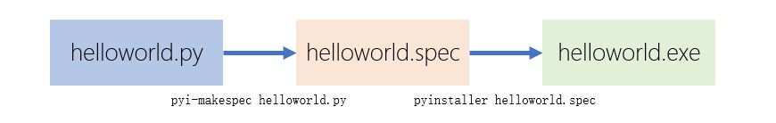

[《Python应用实战》视频课程](https://study.163.com/course/courseMain.htm?courseId=1209533804&share=2&shareId=400000000624093)

# 制作可执行文件

难度：★★★★☆

## 发布Python程序

- Python源代码

    目标机需要先安装好python环境，以及代码依赖的Python库

- Python安装包

    目标机需要先安装好python环境

- docker容器

    目标机需要先安装好docker基础环境

- 二进制可执行文件

    + 无基础环境要求
    + 针对不同操作系统需要制作不同的可执行文件
    + 执行效率稍低

## 一些常用的Freezing工具

- [pyinstaller](https://www.pyinstaller.org/)

  `pip install pyinstaller`

- [fbs](https://build-system.fman.io/)

  `pip install fbs`

- [py2exe](http://www.py2exe.org/)

  `pip install py2exe`

- [py2app](https://py2app.readthedocs.io/en/latest/)

  `pip install py2app`

- [cx_Freeze](https://cx-freeze.readthedocs.io/en/latest/index.html)

  `pip install cx_Freeze`

- [bbfreze](https://pypi.org/project/bbfreeze/)

## 简单使用

- 生成执行目录

  `pyinstaller helloworld.py`

  执行文件为`./dist/helloworld/helloworld.exe`，执行时需包含整个目录

- 生成单个执行文件

  `pyinstaller -F helloworld.py`

  执行文件为`./dist/helloworld.exe`(单个文件)  

- spec定义文件

  

## 一个复杂的应用

#### 应用

比特币账户余额查询

- 源代码
    + [bitcoin_beta3.py](https://github.com/zhujisheng/learn_python/blob/master/06.%E5%9B%BE%E5%BD%A2%E7%94%A8%E6%88%B7%E7%95%8C%E9%9D%A2/programs/bitcoin_beta3.py)
    + [bitcoin_beta.ui](https://github.com/zhujisheng/learn_python/blob/master/06.%E5%9B%BE%E5%BD%A2%E7%94%A8%E6%88%B7%E7%95%8C%E9%9D%A2/programs/bitcoin_beta.ui)
- 预先安装
    + `pip install PyQT5`
    + `pip install bit`

#### 问题与解决

- 初始命令

  `pyinstaller --add-data bitcoin_beta.ui;. -F bitcoin_beta3.py`

- 问题一：找不到`coincurve/libsecp256k1.dll`

  在系统中查找libsecp256k1.dll，放置在目录中，增加命令参数`--add-binary libsecp256k1.dll;coincurve`

- 问题二：找不到`bitcoin_beta.ui`
  ```python
  ##############################################
  # 将                                         #
  # win = uic.loadUi("bitcoin_beta.ui", self)  #
  # 修改成一下代码：                                    #
  ###############################################

  import sys
  from os import path
  bundle_dir = getattr(sys, '_MEIPASS', path.abspath(path.dirname(__file__)))
  path_to_dat = path.join(bundle_dir, 'bitcoin_beta.ui')
  win = uic.loadUi(path_to_dat, self)

  ```

- 问题三：出现Dos窗口

  增加命令参数`-w`

- 完整命令

  `pyinstaller --add-binary libsecp256k1.dll;coincurve --add-data bitcoin_beta.ui;. -F -w bitcoin_beta3.py`

## 核心词汇

- `freezing`

  冻结，将python文件转化为二进制可执行文件

- `specification`

  规格说明书
