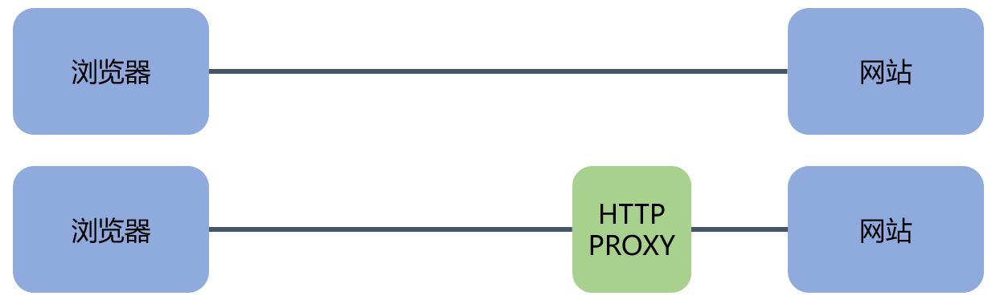

[《Python应用实战》视频课程](https://study.163.com/course/courseMain.htm?courseId=1209533804&share=2&shareId=400000000624093)

# HTTP代理

难度：★★★☆☆

## HTTP PROXY



程序：[http_proxy.py](programs/http_proxy.py)

[亚马逊云主机申请教程](https://study.163.com/course/courseLearn.htm?courseId=1006189053&share=2&shareId=400000000624093#/learn/video?lessonId=1053678473&courseId=1006189053)

## 改进


```python
def xor_encode( bstring ):
    """一个简单编码：两次编码后与原值相同"""
    MASK = 0x55
    ret = bytearray( bstring )
    for i in range(len(ret)):
        ret[i] ^= MASK
    return ret
```

本地程序：[tcp_proxy_encoded.py](programs/tcp_proxy_encoded.py)

云端程序：[http_proxy_encoded.py](programs/http_proxy_encoded.py)


## 核心词汇

- `proxy`

  代理

- `bytearray`

  字节数组
