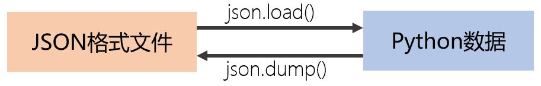
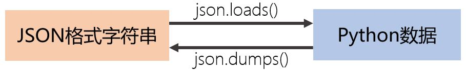

# JSON格式

难度：★★☆☆☆

## 两个JSON样例

- 信息来自homeassistant软件的配置文件`.storage/core.config_entries`
    ```json
    {
        "data": {
            "entries": [
                {
                    "connection_class": "cloud_poll",
                    "data": {
                        "track_home": true
                    },
                    "domain": "met",
                    "entry_id": "413c665b877c4bb1affe87dbb3226886",
                    "options": {},
                    "source": "onboarding",
                    "title": "Home",
                    "version": 1
                },
                {
                    "connection_class": "local_push",
                    "data": {
                        "host": "irrf.local",
                        "password": "hachina",
                        "port": 6053
                    },
                    "domain": "esphome",
                    "entry_id": "2b8cf121ee72436dbc7fe28d9f6ab2bc",
                    "options": {},
                    "source": "zeroconf",
                    "title": "irrf",
                    "version": 1
                }
            ]
        },
        "key": "core.config_entries",
        "version": 1
    }
    ```

- 信息来自：[https://blockchain.info/ticker](https://blockchain.info/ticker)

    ```json
    {
      "USD" : {"15m" : 10002.41, "last" : 10002.41, "buy" : 10002.41, "sell" : 10002.41, "symbol" : "$"},
      "AUD" : {"15m" : 14776.05, "last" : 14776.05, "buy" : 14776.05, "sell" : 14776.05, "symbol" : "$"},
      "BRL" : {"15m" : 41482.01, "last" : 41482.01, "buy" : 41482.01, "sell" : 41482.01, "symbol" : "R$"},
      "CAD" : {"15m" : 13266.77, "last" : 13266.77, "buy" : 13266.77, "sell" : 13266.77, "symbol" : "$"},
      "CHF" : {"15m" : 9913.79, "last" : 9913.79, "buy" : 9913.79, "sell" : 9913.79, "symbol" : "CHF"},
      "CLP" : {"15m" : 7178938.33, "last" : 7178938.33, "buy" : 7178938.33, "sell" : 7178938.33, "symbol" : "$"},
      "CNY" : {"15m" : 70933.12, "last" : 70933.12, "buy" : 70933.12, "sell" : 70933.12, "symbol" : "¥"},
      "DKK" : {"15m" : 67790.36, "last" : 67790.36, "buy" : 67790.36, "sell" : 67790.36, "symbol" : "kr"},
      "EUR" : {"15m" : 9091.41, "last" : 9091.41, "buy" : 9091.41, "sell" : 9091.41, "symbol" : "€"},
      "GBP" : {"15m" : 8019.69, "last" : 8019.69, "buy" : 8019.69, "sell" : 8019.69, "symbol" : "£"},
      "HKD" : {"15m" : 78401.42, "last" : 78401.42, "buy" : 78401.42, "sell" : 78401.42, "symbol" : "$"},
      "INR" : {"15m" : 712231.89, "last" : 712231.89, "buy" : 712231.89, "sell" : 712231.89, "symbol" : "₹"},
      "ISK" : {"15m" : 1245399.01, "last" : 1245399.01, "buy" : 1245399.01, "sell" : 1245399.01, "symbol" : "kr"},
      "JPY" : {"15m" : 1075657.57, "last" : 1075657.57, "buy" : 1075657.57, "sell" : 1075657.57, "symbol" : "¥"},
      "KRW" : {"15m" : 1.194418256E7, "last" : 1.194418256E7, "buy" : 1.194418256E7, "sell" : 1.194418256E7, "symbol" : "₩"},
      "NZD" : {"15m" : 15983.86, "last" : 15983.86, "buy" : 15983.86, "sell" : 15983.86, "symbol" : "$"},
      "PLN" : {"15m" : 39706.08, "last" : 39706.08, "buy" : 39706.08, "sell" : 39706.08, "symbol" : "zł"},
      "RUB" : {"15m" : 640292.53, "last" : 640292.53, "buy" : 640292.53, "sell" : 640292.53, "symbol" : "RUB"},
      "SEK" : {"15m" : 97061.52, "last" : 97061.52, "buy" : 97061.52, "sell" : 97061.52, "symbol" : "kr"},
      "SGD" : {"15m" : 13766.89, "last" : 13766.89, "buy" : 13766.89, "sell" : 13766.89, "symbol" : "$"},
      "THB" : {"15m" : 304921.09, "last" : 304921.09, "buy" : 304921.09, "sell" : 304921.09, "symbol" : "฿"},
      "TWD" : {"15m" : 310084.98, "last" : 310084.98, "buy" : 310084.98, "sell" : 310084.98, "symbol" : "NT$"}
    }
    ```

- JSON标准介绍

  [http://www.json.org/json-zh.html](http://www.json.org/json-zh.html)

- JSON通俗介绍

  [https://www.jianshu.com/p/4cecd7c9e3b9](https://www.jianshu.com/p/4cecd7c9e3b9)

  [http://www.ruanyifeng.com/blog/2009/05/data_types_and_json.html](http://www.ruanyifeng.com/blog/2009/05/data_types_and_json.html)

## JSON格式信息的基本操作

- JSON文件

  

  ```python
  import json

  # 从json格式文件载入内容
  with open('/home/pi/.homeassistant/.storage/core.config_entries') as fp:
    c = json.load(fp)
  
  ......

  # 保存到json格式文件中
  with open('backup.json', 'w') as fp:
    json.dump(c, fp)
    # json.dump(c, fp, indent=2)
  ```

- JSON字符串

  

  ```python
  import json

  # 从网络获得JSON格式信息
  import requests
  json_string = requests.get('https://blockchain.info/ticker').content.decode()
  prices = json.loads(json_string)
  
  ......

  ```


## JSON与Python之间的转换对应关系

|**JSON**|**Python**|
| :-----| :---- |
|object|dict|
|array|list|
|string|str|
|number(int)|int|
|number(real)|float|
|true|True|
|false|False|
|null|None|

- [官方文档](https://docs.python.org/3/library/json.html)


## 核心词汇

- `JSON`

  JavaScript Object Notation的简称。JSON是一种结构化信息的格式定义，一般用于配置文件，或者网络信息的传输。

- `load`

  加载

- `dump`

  倾倒，转储

- `indent`

  缩进
