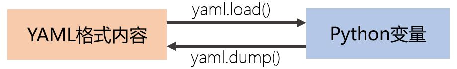

# YAML格式

难度：★★☆☆☆

## YAML基础

- YAML与JSON一样，可以表达复杂结构的信息
- 相比较于JSON，YAML更易阅读与手工编辑
- YAML的基础结构
    + 标量（scalar）
    + 序列（sequence）

        ```yaml
        - 苹果
        - 梨
        - 菠萝
        ```

        *`-` 后面要有空格，同一层次的序列元素`-`必须对齐*

    + 映射（mapping）

        ```yaml
        name: John Smith
        age: 33
        ```

        *冒号后面要有空格，同一层次的key必须相同缩进空格对齐*

- 嵌套
    + 序列的元素可以是一个标量，也可以是另一个序列或者一个映射
    + 映射的value可以是一个标量，也可以是一个序列或者一个映射

        ```yaml
        # 场景配置信息
        scene:
          - name: Livingroom normal
            entities:
                light.light1:
                    state: on
                    transition: 2
                    brightness_pct: 60
                light.light2:
                    state: on
                    transition: 2
                    brightness_pct: 85
          - name: Livingroom dim
            entities:
                light.light1:
                    state: on
                    transition: 2
                    brightness_pct: 30
                light.light2:
                    state: on
                    transition: 2
                    brightness_pct: 55
        ```

- [YAML1.2标准](https://yaml.org/spec/1.2/spec.html)

- 安装pyyaml库

  `pip install pyyaml`

## YAML格式信息的基本操作

  

  ```python

  import yaml
  
  # 定义一个yaml格式的字符串
  yaml_str = '''# 场景配置信息
  scene:
    - name: Livingroom normal
      entities:
          light.light1:
              state: on
              transition: 2
              brightness_pct: 60
          light.light2:
              state: on
              transition: 2
              brightness_pct: 85
    - name: Livingroom dim
      entities:
          light.light1:
              state: on
              transition: 2
              brightness_pct: 30
          light.light2:
              state: on
              transition: 2
              brightness_pct: 55
  '''
  
  # 将yaml格式字符串转成python变量
  c = yaml.load(yaml_str, Loader=yaml.FullLoader)
  #yaml.load(yaml_str, Loader=yaml.BaseLoader)
  
  # 将yaml格式文件转成python变量
  with open('PATH_AND_FILENAME') as fp:
      c = yaml.load(fp)
  
  # 按格式打印变量
  import pprint
  pprint.pprint(c)
  
  # 将Python变量转换为yaml格式的字符串
  yaml_str = yaml.dump(c)
  
  # 将Python变量保存为yaml格式文件
  with open('abc.yaml', 'w') as fp:
      yaml.dump(c, fp)
  
  ```

- [一个重新定义`Loader`的样例](https://github.com/home-assistant/home-assistant/blob/dev/homeassistant/util/yaml/loader.py#L62)

- [官方文档](https://pyyaml.org/wiki/PyYAMLDocumentation)


## 核心词汇

- `scalar`

  标量，只有大小没有方向的量。在YAML中，scalar指简单结构的字符串或数字。

- `sequence`

  序列

- `mapping`

  映射

- `YAML`

  Yet Another Markup Language； YAML Ain't Markup Language
