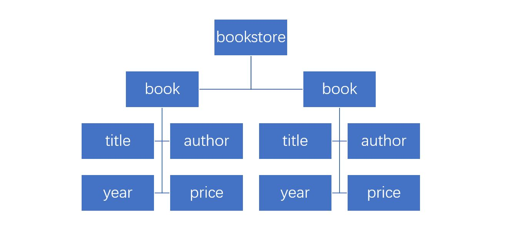
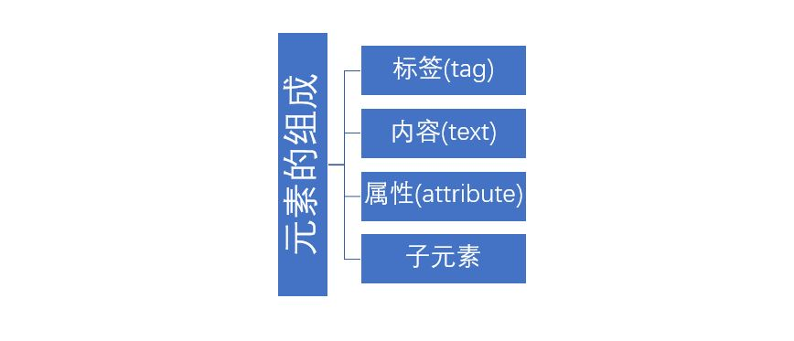
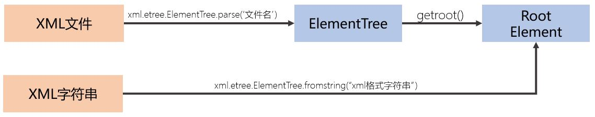

# XML

难度：★★★★☆

## XML基础
```xml
<bookstore>
    <book category="CHILDREN">
        <title>Harry Potter</title>
        <author>J K. Rowling</author>
        <year>2005</year>
        <price>29.99</price>
    </book>
    <book category="WEB">
        <title>Learning XML</title>
        <author>Erik T. Ray</author>
        <year>2003</year>
        <price>39.95</price>
    </book>
</bookstore>
```

- 标记与内容
- 标记成对出现，每对标记包含的部分称为元素（Element）
- 父元素包含若干个子元素
- xml文本，有且仅有一个根元素，从根元素开始，整个信息由元素组成一棵树

  

- 每个元素，可以包含若干属性



[XML介绍](http://www.runoob.com/xml/xml-tutorial.html)

## xml.etree.ElementTree库



```python
xml_str = '''<bookstore>
    <book category="CHILDREN">
        <title>Harry Potter</title>
        <author>J K. Rowling</author>
        <year>2005</year>
        <price>29.99</price>
    </book>
    <book category="WEB">
        <title>Learning XML</title>
        <author>Erik T. Ray</author>
        <year>2003</year>
        <price>39.95</price>
    </book>
</bookstore>
'''

import xml.etree.ElementTree as ET

# 从xml字符串中载入内容，返回根元素
root = ET.fromstring( xml_str )

# 从xml文件中载入内容，获得根元素
#tree = ET.parse('input.xml')
#root = tree.getroot()

# 轮询两层子元素
print( root.tag, root.attrib, root.text)
for son in root:
    print( son.tag, son.attrib, son.text)
    for grandson in son:
        print( "\t", grandson.tag, grandson.attrib, grandson.text)

# 找到所有author标签
for author in root.iter('author'):
    print(author.text)

# 写成xml字符串
xml_str = ET.tostring( root, encoding='unicode' )

# 保存为xml文件
tree.write('output.xml')
```

[xml.etree.ElementTree库](https://docs.python.org/zh-cn/3/library/xml.etree.elementtree.html)

## xmltodict库

- 安装

  `pip install xmltodict`

- 操作

  

```python
import xmltodict

# 从xml格式字符串中载入内容，c为一个dict类型
c = xmltodict.parse( xml_str )

# 从xml文件中载入内容
with open('input.xml','rb') as fp:
    c = xmltodict.parse( fp )

# 访问信息
c['bookstore']['book'][0]['title']

# 将dict类型数据转换成xml格式字符串
xmltodict.unparse(c, pretty=True)
```
  - 转换规则如下：
    1. 每个xml中的元素与dict类型中的一个key-value对对应，元素的tag对应于key-value对中的key
    2. 如果一个元素没有属性与子元素，仅有内容，那么这个key-value对的value就是内容的文本
    3. 一个元素的属性或者子元素，转化为key-value对中的value值（value值为dict类型）。如果是属性，需要在key之前增加`@`符号，以标注此为属性，而不是一个子元素。
    4. 带有属性或子元素的元素，如果元素中还有内容，那么内容也转化为一个key-value对，key的名称是`#text`。
    5. 如果相邻的元素标签相同，则合并为一个key-value对，value值为一个包含原有value值的数组。

[xmltodict库](https://github.com/martinblech/xmltodict)

## 核心词汇

- `XML`

  eXtensible Markup Language，可扩展标记语言。

- `element`

  元素，element是xml信息的基础结构。

- `tag`

  标签

- `attribute`

  属性

