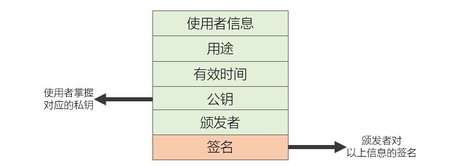

[《Python应用实战》视频课程](https://study.163.com/course/courseMain.htm?courseId=1209533804&share=2&shareId=400000000624093)

# 数字证书与PKI(1)

难度：★★★★☆

## 数字证书基本概念与序列化

数字证书是表明身份信息的电子文件。

- 序列化-信息结构定义

  + **X.509**

- 序列化-编码方式
  + DER
  + PEM
  + PKCS12
  + PKCS7

## 数字证书中的内容



```python
from cryptography import x509
from cryptography.hazmat.primitives.asymmetric import padding
from cryptography.hazmat.backends import default_backend

# 读取保存的证书文件（DER编码）
with open('github_der.cer', 'rb') as f:
  der_data = f.read()

# 证书信息的反序列化
cert = x509.load_der_x509_certificate(der_data, default_backend())

# 证书版本与序列号
cert.version
cert.serial_number

# 使用者信息
cert.subject

# 网站证书的域名
for dn in cert.extensions.get_extension_for_class(x509.SubjectAlternativeName).value:
    print(dn.value)

# 所有的extensions
for ext in cert.extensions:
    print(ext)

# 证书用途
cert.extensions.get_extension_for_class(x509.BasicConstraints)
cert.extensions.get_extension_for_class(x509.KeyUsage)
cert.extensions.get_extension_for_class(x509.ExtendedKeyUsage)

# 证书有效期
cert.not_valid_before
cert.not_valid_after

# 公钥
cert.public_key()

# 证书颁发者
cert.issuer

# 证书颁发者的证书下载地址
cert.extensions.get_extension_for_class(x509.AuthorityInformationAccess).value[1].access_location.value

# 签名
cert.signature_hash_algorithm
cert.signature_algorithm_oid
cert.signature

#######
# OID #
#######
# 网站证书的域名，以前放在这儿
x509.oid.NameOID.COMMON_NAME
cert.subject.get_attributes_for_oid(x509.oid.NameOID.COMMON_NAME)[0].value

# 网站证书的域名，现在放在这儿
x509.oid.ExtensionOID.SUBJECT_ALTERNATIVE_NAME
cert.extensions.get_extension_for_oid(x509.oid.ExtensionOID.SUBJECT_ALTERNATIVE_NAME).value[0].value

# 证书的基础约束
x509.oid.ExtensionOID.BASIC_CONSTRAINTS
cert.extensions.get_extension_for_oid(x509.oid.ExtensionOID.BASIC_CONSTRAINTS).value.ca
```

## 数字证书的信任链

- 拥有颁发者的证书，就能验证使用者证书的真实性
- 颁发者必须是CA类型的证书
- 根证书：颁发者与使用者相同，使用证书中的公钥验证本证书的签名
- 根证书事先安装在操作系统和浏览器中

```python
# 续上

# 读取保存的CA证书文件（PEM编码）
with open('digicert_pem.cer', 'rb') as f:
  pem_data = f.read()

# 证书信息的反序列化
cert_ca = x509.load_pem_x509_certificate(pem_data, default_backend())

# CA证书用途
cert_ca.extensions.get_extension_for_class(x509.BasicConstraints)
cert_ca.extensions.get_extension_for_class(x509.KeyUsage)

#################################################
# 使用DIGICERT的CA证书，验证GITHUB网站证书的有效性 #
#################################################
issuer_public_key = cert_ca.public_key()

issuer_public_key.verify(cert.signature,
                         cert.tbs_certificate_bytes,
                         padding.PKCS1v15(),
                         cert.signature_hash_algorithm
                         )

```

## 浏览器对网站证书的验证

- 证书本身是否真实
  + 验证证书的签名
  + 验证证书颁发者的证书的签名
  + 确认根证书是否可信任
- 当前的环境是否满足证书描述
  + 当前时间是否在证书的有效期内
  + 证书中使用者信息，是否与当前访问的域名一致
- 使用者是否拥有证书的私钥
  + 基于证书中的公钥，进行验证或者密钥交换


## 核心词汇

- `digital certificate`

  数字证书

- `CA`

  Certification Authority，颁发证书的机构

- `issuer`

  发行者，颁发(证书)者

- `oid`

  Object Identifier，对象标识符

