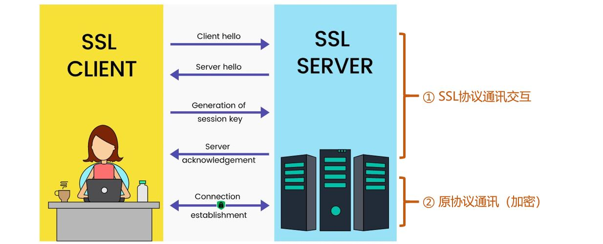

[《Python应用实战》视频课程](https://study.163.com/course/courseMain.htm?courseId=1209533804&share=2&shareId=400000000624093)

# SSL/TLS

难度：★★★☆☆

## 什么是SSL/TLS

- SSL是提供通讯**保密性**和通讯**数据完整性**的一种协议
- SSL广泛应用于各种通讯连接中
    + `HTTP` + `SSL` （`HTTPS`）
    + `IMAP` + `SSL`
    + `POP3` + `SSL`
    + `SMTP` + `SSL`
    + `MQTT` + `SSL`
    + …… + `SSL`
- SSL对原通讯协议的改进



- SSL在通讯服务器端配置数字证书（必须）

  服务器端包含以下配置项：
    + 服务器端数字证书
    + 数字证书对应的私钥
    + 保护私钥的密码（如果设置的话）

- SSL在通讯客户端配置数字证书（偶尔）

- TLS是SSL的升级版本

## ssl库

[Python的ssl库](https://docs.python.org/3/library/ssl.html)

#### `ssl.SSLContext`

```python
import ssl

# 创建context
context = ssl.create_default_context()

# 创建某个ssl/tls版本协议的context
#context = ssl.SSLContext(ssl.PROTOCOL_TLSv1_2)

#############################
# SSLContext中的一些可配置项 #
#############################

# 可用的协议
context.protocol

# 一些选择项
context.options

# 对证书有效性的接受模式
context.verify_mode

# 对证书有效性的验证选择项
context.verify_flags
# 增加检查CRL
context.verify_flags |= ssl.VERIFY_CRL_CHECK_LEAF
# 取消检查CRL
context.verify_flags &= ~ssl.VERIFY_CRL_CHECK_LEAF

# 是否检查域名与证书中的一致
context.check_hostname

# 如果没有subject alternative name extension时，是否检查subject common name
context.hostname_checks_common_name

########################
# 当前SSLContext的状态 #
########################

# 当前context中的证书
context.cert_store_stats()

# SSL连接的统计数据
context.session_stats()
```

#### `ssl.SSLSocket`

```python
# 续上

import socket

# 建立常规的TCP连接
hostname = 'www.baidu.com'
sock = socket.create_connection((hostname, 443))

# 在常规TCP连接基础上增加SSL安全通讯
ssock = context.wrap_socket(sock, server_hostname=hostname)

# 查看服务器端的证书
ssock.getpeercert()

# 查看后续通讯中具体使用的对称加密算法
ssock.cipher()

# 向服务器端发送与接收数据（符合原协议的定义）
ssock.sendall(b"GET / HTTP/1.0\nHost: "
              + hostname.encode()
              + b"\n\n")

buffer = []
while True:
    d=ssock.recv(1024)
    if d:
        buffer.append(d)
    else:
        break

data = b''.join(buffer)

```

## 核心词汇

- `SSL`

  Secure Socket Layer，安全套接字层

- `TLS`

  Transport Layer Security，传输层安全协议

- `session`

  会话

- `context`

  上下文，背景环境
