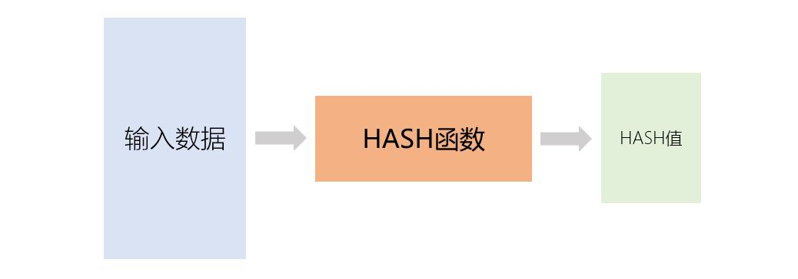

[《Python应用实战》视频课程](https://study.163.com/course/courseMain.htm?courseId=1209533804&share=2&shareId=400000000624093)

# HASH函数与文件HASH值

难度：★★☆☆☆

## HASH基础介绍



- 特点
    + 输入可以是任意数据，输出是固定长度的bytes
    + 从输入计算输出很简单；但如果仅知道输出，很难找到可能的输入
    + 输入变化很小，输出也会有很大的变化

- 常用的HASH函数

  |HASH函数|输出长度(字节)|说明|
  | :-----| :---- | :---- |
  |MD5|16|已经不够安全，不建议使用|
  |SHA-1|20|已经不够安全，不建议使用|
  |SHA-224|28|属于SHA-2系列算法|
  |SHA-256|32|属于SHA-2系列算法|
  |SHA-384|48|属于SHA-2系列算法|
  |SHA-512|64|属于SHA-2系列算法|
  |SHA-512/256|32|属于SHA-2系列算法|
  |SHA3-256|32|属于SHA-3系列算法|
  |SHA3-512|64|属于SHA-3系列算法|
  |BLAKE2s|在函数初始化时设定(1-32)|属于BLAKE2系列算法|
  |BLAKE2b|在函数初始化时设定(1-64)|属于BLAKE2系列算法|

- 常用的HASH函数库
    + [hashlib](https://docs.python.org/3/library/hashlib.html)
    + （pycryptodome库）[Crypto.Hash](https://www.pycryptodome.org/en/latest/src/hash/hash.html)
    + （cryptography库）[cryptography.hazmat.primitives.hashes](https://cryptography.io/en/latest/hazmat/primitives/cryptographic-hashes/)

## hashlib

- 基本使用

```python
import hashlib

# 所有可用的hash函数
hashlib.algorithms_available

# 可以直接调用的hash函数
hashlib.algorithms_guaranteed

# 定义输入hash函数的数据
INPUT_MESSAGE1 = b'data input '
INPUT_MESSAGE2 = b'to the Hash function'
INPUT_MESSAGE = INPUT_MESSAGE1 + INPUT_MESSAGE2

# 直接简单调用
h = hashlib.sha256(INPUT_MESSAGE)
h.hexdigest()

# 逐步输入数据
h = hashlib.sha256()
h.update(INPUT_MESSAGE1)
h.update(INPUT_MESSAGE2)
h.hexdigest()

# 通过new函数初始化hash函数
h = hashlib.new('sha256')
h.update(INPUT_MESSAGE)
h.hexdigest()

# 输出bytes类型
h.digest()
```

## 一个简单应用：计算文件的HASH值

  *很多下载的软件包会公布自己的HASH值。此程序计算下载到本地的文件的HASH值，可以与公布的HASH值对比，确定下载过程是否出错。*

  [file-hash.py](programs/file-hash.py)


## 核心词汇

- `hash`

  哈希函数、散列函数

- `algorithm`

  算法

- `digest`

  摘要
