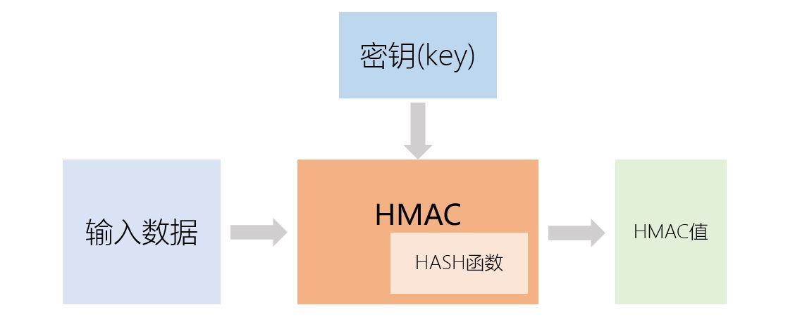

[《Python应用实战》视频课程](https://study.163.com/course/courseMain.htm?courseId=1209533804&share=2&shareId=400000000624093)

# HASH应用：HMAC

难度：★★☆☆☆

## HMAC

[HMAC标准（rfc2104）](https://tools.ietf.org/html/rfc2104)



1. HMAC是通过调用某个hash函数来实现的：调用md5的HMAC称为hmac-md5，调用sha256的HMAC被称为hmac-sha256
2. HMAC在初始化时，它需要额外输入一个key
3. HMAC是保障数据真实性的可靠手段

## Python中的HMAC实现

- 常用的HMAC库
    + [python自带的hmac库](https://docs.python.org/3/library/hmac.html)
    + [(cryptography库)cryptography.hazmat.primitives.hmac](https://cryptography.io/en/latest/hazmat/primitives/mac/hmac/)
    + [(pycryptodome库)Crypto.Hash.HMAC](https://www.pycryptodome.org/en/latest/src/hash/hmac.html)
- [python自带的hmac库](https://docs.python.org/3/library/hmac.html)

    ```python
    import hashlib, hmac

    # 发送者与接收者共享的key
    KEY = b'secret shared by sender and receiver'

    # 传递的消息，以及它的HMAC摘要（16进制表达）
    MESSAGE = b'message being sent'
    DIGEST = '6386f95fd2612d05fb44df9330b70d7013c5e1dab3588eead3e850a024ef563f'

    # 计算消息的摘要
    h = hmac.new(KEY, digestmod=hashlib.sha256)
    h.update(MESSAGE)
    result = h.hexdigest()

    # 对比计算得到的HMAC摘要，与收到的HMAC摘要是否一致
    hmac.compare_digest(result, DIGEST)
    ```
## 补充知识点
- blake2

    HASH函数[blake2](https://docs.python.org/3/library/hashlib.html?highlight=hashlib#keyed-hashing)，在初始化时能输入key，从而起到类似HMAC的作用

- CMAC

    CMAC是与HMAC功能相同的数据真实性保障手段，但CMAC是基于对称加密技术而不是HASH函数来实现的。

## 核心词汇

- `HMAC`

  Hash-based Message Authentication Code

- `CMAC`

  Cipher-based Message Authentication Code

- `authenticity`

  真实性，原真性
