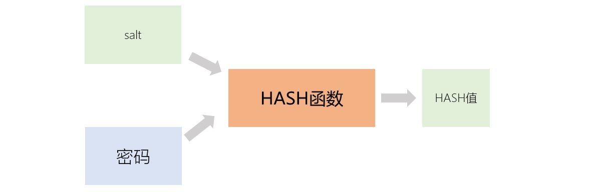
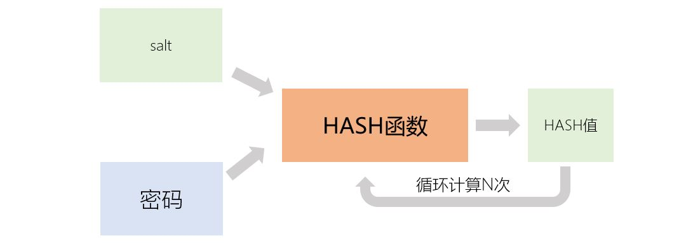

[《Python应用实战》视频课程](https://study.163.com/course/courseMain.htm?courseId=1209533804&share=2&shareId=400000000624093)

# HASH应用：Linux中的用户密码

难度：★★★★☆

## 密码保存与验证

*我们不能确保保存的数据不被泄露。那么，我们该如何保存用户设置的密码呢？*

- 密码以明文保存

  *风险：一旦数据泄露，密码就被泄露了。*
    
- 保存密码的HASH值

  

  *风险：可以提前穷举“密码-hash值”表。将保存的hash值，通过此表，反查密码。*

- 保存salt与密码的HASH值

  

  *风险：hash计算很快，可以在拿到hash值后穷举计算。*

- 保存salt、循环次数、密码的HASH值

  

## Linux系统中的密码

- 密码保存文件
    + `/etc/passwd`
    + `/etc/shadow`
- 密码保存字符串格式

  `$N$rounds=n$salt$hash值`

  由$隔开的几个字段：
    1. 算法标识
    
       |数值|算法|
       | :-----| :---- |
       |1|MD5|
       |2a|Blowfish|
       |5|SHA-256|
       |6|SHA-512|

    2. 循环计算次数，如果没有这个字段，缺省是rounds=5000
    3. salt
    4. 最终计算得到的hash值

## linux下相关的python库

- [pwd库](https://docs.python.org/3/library/pwd.html)

  `/etc/passwd`文件的读取接口库

  - `pwd.getpwuid(uid)`

    根据用户uid，返回用户信息

  - `pwd.getpwnam(name)`

    根据用户名，返回用户信息

  - `pwd.getpwall()`

    返回所有用户的用户信息

  - 用户信息的内容

    |INDEX|属性名|含义|
    | :-----| :-----| :-----|
    |0|`pw_name`|用户登录名|
    |1|`pw_passwd`|用户密码信息|
    |2|`pw_uid`|用户ID|
    |3|`pw_gid`|用户所属组ID|
    |4|`pw_gecos`|用户备注信息|
    |5|`pw_dir`|用户根目录|
    |6|`pw_shell`|用户shell|

- [spwd库](https://docs.python.org/3/library/spwd.html)

  `/etc/shadow`文件的读取接口库

  - `pwd.getspnam(name)`

    根据用户名，返回用户信息

  - `pwd.getspall(name)`

    返回所有用户的用户信息

  - 用户信息的内容

    |INDEX|属性名|含义|
    | :-----| :-----| :-----|
    |0|`sp_namp`|用户登录名|
    |1|`sp_pwdp`|用户密码信息|
    |2|`sp_lstchg`|密码最后更改事件|
    |3|`sp_min`|更改密码的最小天数|
    |4|`sp_max`|更改密码的最大天数|
    |5|`sp_warn`|密码过期前提醒用户天数|
    |6|`sp_inact`|密码过期后账号有效时间|
    |7|`sp_expire`|密码过期时间（从1970-01-01开始算起）|
    |8|`sp_flag`|保留字段|

- [crypt库](https://docs.python.org/3/library/crypt.html)

  密码计算库

    + `crypt.methods`

      支持的算法列表

    + `crypt.mksalt(method=None, *, rounds=None)`

      生成算法标识、循环次数与随机salt构成的字符串。

    + `crypt.crypt(word, salt=None)`

      从密码计算它的存储字符串

## 样例：操作系统用户密码验证

[Linux下用户名/密码验证程序](programs/linux_login.py)

## 核心词汇

- `salt`

  盐；密码计算HASH值时，额外加入的随机数据

- `round`

  回合，循环次数

- `shadow`

  阴影，隐蔽处；Linux下保存用户密码信息的文件名
