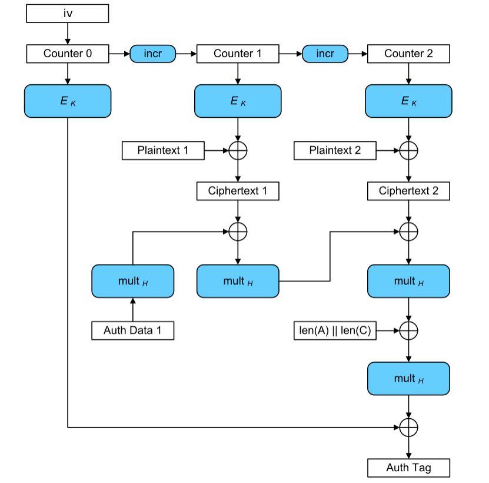

[《Python应用实战》视频课程](https://study.163.com/course/courseMain.htm?courseId=1209533804&share=2&shareId=400000000624093)

# 对称加密算法

难度：★★★★★

## 对称加密算法基本形态


- 块加密算法与流加密算法
    + “流加密”是一个字节一个字节的计算加密结果
    + “块加密”是若干字节一起计算加密结果

  |加密算法|密钥长度(bit)|块加密/流加密|备注|
  | :-----| :---- | :---- | :---- |
  |AES|128、192或256|块加密|目前用的最广泛的加密算法|
  |ChaCha20|256|流加密||
  |Salsa20|256或128|流加密||
  |DES|64(56位有效）|块加密|历史较长，不建议使用|
  |3-DES|64、128或192|块加密|历史较长，不建议使用|
  |RC2|8-128|块加密|历史较长，不建议使用|
  |RC4|40-2048|流加密|历史较长，不建议使用|
  |Blowfish|32-448|块加密|历史较长，不建议使用|
  |CAST-28|40-128|块加密|历史较长，不建议使用|

## 块加密算法的应用模式与加密算法中的一些概念

|块加密算法的应用模式|全称|解释|
| :-----| :---- | :---- |
|ECB|Electronic CodeBook|原始形态应用模式|
|CBC|Ciphertext Block Chaining|密文块链模式|
|CFB|Cipher FeedBack|密文反馈模式，将块加密转为流加密|
|OFB|Output FeedBack|输出反馈模式，将块加密转为流加密|
|CTR|CounTeR|计数模式，将块加密转为流加密|
|CCM|Counter with CBC-MAC|AEAD模式|
|GCM|Galois/Counter Mode|AEAD模式|
|SIV|Synthetic Initialization Vector|AEAD模式|
|OCB|Offset CodeBook mode|AEAD模式|

#### 【ECB模式、无前后关联加密的弱点、Padding】

- 明文需要补足对齐加密块的长度（padding）
- 加密一块一块的进行，相同的明文块会出现相同的密文块


#### 【CBC模式、IV变量】

- CBC模式中每一块加密结果，参于后续加密计算，有效防止相同明文块得到相同密文块的状况
- CBC模式也需要补足明文，对齐加密块长度
- 加密与解密中增加IV变量，在两端需要一致
- IV与nonce的使用原则：相同的key不用相同的IV（或nonce）初始化


      
#### 【OFB模式、块加密转流加密】

- OFB模式，将块加密转为流加密


#### 【GCM模式、信息的真实性保障】

- 单纯的加密能保证信息的机密性，但无法保证信息的完整性
- AEAD（Authenticated Encryption with Associated Data）
- GCM模式是一种AEAD
- 部分信息可以只保障完整性，不进行加密计算


      


## Python中的对称加解密实现

- 常用的对称加解密库
    + [(pycryptodome库)Crypto.Cipher](https://www.pycryptodome.org/en/latest/src/cipher/cipher.html)
    + [(cryptography库)cryptography.hazmat.primitives.ciphers](https://cryptography.io/en/latest/hazmat/primitives/symmetric-encryption/)
    + [(cryptography库)cryptography.hazmat.primitives.ciphers.aead](https://cryptography.io/en/latest/hazmat/primitives/aead/)
    + [(cryptography库)cryptography.fernet](https://cryptography.io/en/latest/fernet/)

- 使用pycryptodome库实际操作加密与解密


```python
'''
加密端程序
'''

from Crypto.Cipher import AES

# 通讯两端共享的信息，16bytes的key和16bytes的nonce
key = b'1234567890123456'

# 要传递的信息
header = b'public message'
nonce = b'1122334455667788'
#nonce = get_random_bytes(16)
data = b'secret message'

# 加密与计算auth tag
cipher = AES.new(key, AES.MODE_GCM, nonce=nonce)
cipher.update(header)
cipher.update(nonce)
ciphertext = cipher.encrypt(data)
tag = cipher.digest()

# 发送给对方的数据
header
nonce
ciphertext
tag
```

```python
'''
解密端程序
'''

from Crypto.Cipher import AES

# 通讯两端共享的信息，16bytes的key和16bytes的nonce
key = b'1234567890123456'

# 收到的信息
header = b'public message'
nonce = b'1122334455667788'
ciphertext = b'\x92\xcdG\xb9\x9c\x8e\x95\xa9\x86\x0fqbr\xde'
tag = b'\xf0\xf9\x98N\x89N\xdb\xafT\xa2s\x81_.\x8au'

# 解密
cipher = AES.new(key, AES.MODE_GCM, nonce=nonce)
cipher.update(header)
cipher.update(nonce)
plaintext = cipher.decrypt(ciphertext)

# 验证真实性
cipher.verify(tag)

# 获得的数据
header
nonce
plaintext
```


## 核心词汇

- `symmetric cipher`

  对称加密

- `block cipher`

  块加密

- `stream cipher`

  流加密

- `confidentiality`

  保密性，机密性

- `integrity`

  完整性
