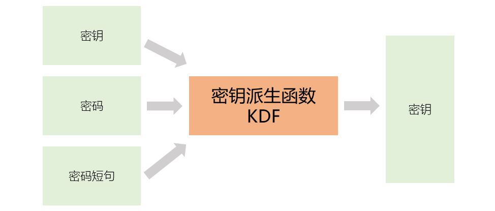

[《Python应用实战》视频课程](https://study.163.com/course/courseMain.htm?courseId=1209533804&share=2&shareId=400000000624093)

# 密钥派生函数(KDF)

难度：★★☆☆☆

## 密钥派生函数(KDF)



#### 主要用途

- 密码保存（参见《[HASH应用：Linux中的用户密码](4.HASH应用：Linux中的用户密码.md)》）
- 生成对称加密算法中的Key

#### 常见的KDF

- PBKDF2

  *PBKDF2一般用于从password生成密钥，也可用于密码保存*

- HKDF

  *HKDF一般用于从一个Key派生出另一个Key*

- X963KDF

  *一般用户密钥交换后，通过交换得到的密钥生成需要长度的密钥*

- scrypt

  *一般用于密码保存*

- bcrypt

  *一般用于密码保存；可以认为Linux下的密码保存就是bcrypt的变种*


#### KDF中常见的一些参数

- algorithm

  *KDF一般要求使用一个HASH函数，此参数指定使用的HASH函数*

- length(dkLen)

  *产生的Key的长度*

- salt

  *参于运算的一个变量，一般随机生成，无保密性要求；相同Key的派生使用相同的salt*

- info

  *对生成Key的一些信息标识，也会参于运算；相同Key的派生使用相同的info*

- rounds(iterations)

  *循环次数；一般用于密码保存类应用的KDF，以降低计算速度*

- cpu或内存消耗

  *有些算法可以传入与计算资源消耗相关的量；一般用于密码保存类应用的KDF，以降低计算速度*

## Python中的KDF实现

- [hashlib](https://docs.python.org/3/library/hashlib.html#key-derivation)
- （第三方PyCryptodome库）[Crypto.Protocol.KDF](https://www.pycryptodome.org/en/latest/src/protocol/kdf.html)
- （第三方Cryptography库）[cryptography.hazmat.primitives.kdf](https://cryptography.io/en/latest/hazmat/primitives/key-derivation-functions/)

#### 样例：使用三种不同库，使用相同的输入，由pbkdf2派生Key

```python
'''
使用三种不同库，使用相同的输入，由pbkdf2派生Key。
'''

password = b'my super secret'
salt = b'my salt'
rounds = 1000000
key_length = 32

# 使用hashlib库
import hashlib
key_by_hashlib = hashlib.pbkdf2_hmac( hash_name = 'sha256',
                                      password = password,
                                      salt = salt,
                                      iterations = rounds,
                                      dklen = key_length)

# 使用PyCryptodome库
from Crypto.Protocol.KDF import PBKDF2
from Crypto.Hash import SHA256
key_by_pycryptodom = PBKDF2( password = password,
                             salt = salt,
                             dkLen= key_length,
                             count = rounds,
                             hmac_hash_module=SHA256 )

# 使用Cryptography库
from cryptography.hazmat.primitives import hashes
from cryptography.hazmat.primitives.kdf.pbkdf2 import PBKDF2HMAC
from cryptography.hazmat.backends import default_backend
backend = default_backend()
kdf = PBKDF2HMAC( algorithm = hashes.SHA256(),
                  length = key_length,
                  salt = salt,
                  iterations = rounds,
                  backend = backend )
key_by_cryptography = kdf.derive(password)
```

#### 样例：生成Key时消耗不同的计算资源

```python
from Crypto.Protocol.KDF import scrypt
from Crypto.Random import get_random_bytes

password = b'my super secret'
salt = get_random_bytes(16)
key_fast = scrypt(password, salt, 16, N=2**14, r=8, p=1)

key_slow = scrypt(password, salt, 16, N=2**19, r=8, p=1)
```

注：关于N、r、p参数选择的详细解释，可以参见[相关文档](http://www.tarsnap.com/scrypt/scrypt-slides.pdf)

## 核心词汇

- `derive`

  派生、衍生

- `KDF`

  Key Derive Function，密钥派生函数

- `iteration`

  迭代、循环
