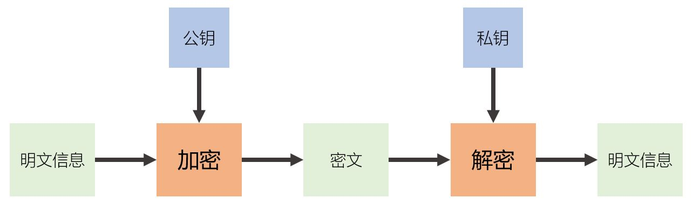
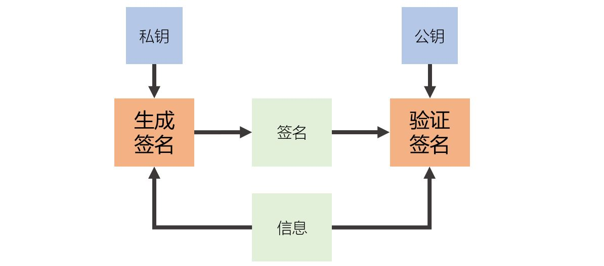
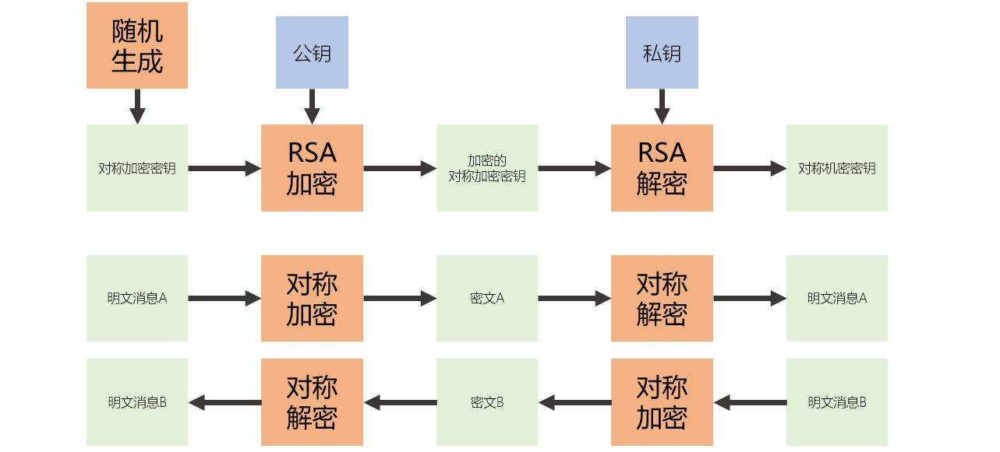
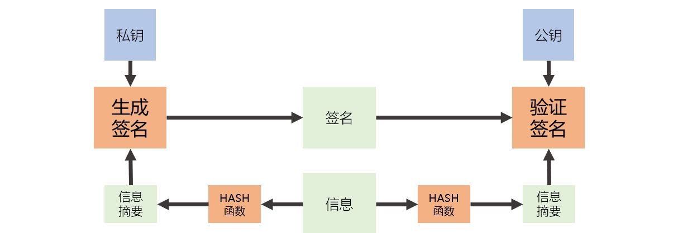

[《Python应用实战》视频课程](https://study.163.com/course/courseMain.htm?courseId=1209533804&share=2&shareId=400000000624093)

# 非对称加密算法(1)

难度：★★★☆☆

## 非对称加密的基础模型

- 加解密



- 数字签名



- 公钥-私钥是一一匹配的
- 公钥是非机密性信息，公开的，从公钥无法推导出私钥
- 私钥是机密的，除了备份，不应该有多个副本
- 非对称加密算法的运算速度慢
- 底层数学机制分别基于大数的质数分解、离散对数、椭圆曲线等不同领域的问题，所以不同算法的参数、应用模型都有很大的差别

## 算法实践

- （第三方Cryptography库）[cryptography.hazmat.primitives.asymmetric](https://cryptography.io/en/latest/hazmat/primitives/asymmetric/)
- （第三方PyCryptodome库）[Crypto.PublicKey](https://www.pycryptodome.org/en/latest/src/public_key/public_key.html)

*注：pyCryptodome库中非对称加密算法实现并不完整*

#### 使用RSA算法传递对称加密密钥



```python
import secrets
from cryptography.hazmat.backends import default_backend
from cryptography.hazmat.primitives.asymmetric import rsa
from cryptography.hazmat.primitives import hashes
from cryptography.hazmat.primitives.asymmetric import padding

############
# 初始准备 #
############
# A使用的私钥
private_key = rsa.generate_private_key(public_exponent=65537,
                                       key_size=2048,
                                       backend=default_backend()
                                       )

# B使用的公钥
public_key = private_key.public_key()

########################################
# 在B端随机生成对称加密密钥，使用公钥加密 #
########################################
session_key = secrets.token_bytes(32)
cipher_session_key = public_key.encrypt(session_key,
                                        padding.OAEP(
                                            mgf=padding.MGF1(algorithm=hashes.SHA256()),
                                            algorithm=hashes.SHA256(),
                                            label=None
                                            )
                                        )

###############################
# 在A端使用私钥解密对称加密密钥 #
###############################
session_key_A = private_key.decrypt(cipher_session_key,
                                    padding.OAEP(
                                        mgf=padding.MGF1(algorithm=hashes.SHA256()),
                                        algorithm=hashes.SHA256(),
                                        label=None
                                        )
                                    )


#################################################################
# A端与B端拥有了相同的对称加密密钥，就可以使用对称加密进行消息传递了 #
#################################################################


```

一些附加说明：
- RSA算法进行加解密时，需要指定一个补齐函数
- 加解密中补齐函数使用OAEP或者PKCS1v15（推荐使用OAEP）
- 补齐过程中会引入随机变量，所以相同数据在相同公钥加密后，结果每次是不同的；但解密都还原成原始数据

#### 使用RSA算法进行数据签名与验证



```python
import secrets
from cryptography.hazmat.backends import default_backend
from cryptography.hazmat.primitives.asymmetric import rsa
from cryptography.hazmat.primitives import hashes
from cryptography.hazmat.primitives.asymmetric import padding
from cryptography.hazmat.primitives.asymmetric import utils

############
# 初始准备 #
############
# 要进行数字签名的信息
message = b"A message I want to sign"

# 签名方使用的私钥
private_key = rsa.generate_private_key(public_exponent=65537,
                                       key_size=2048,
                                       backend=default_backend()
                                       )

# 验证方使用的公钥
public_key = private_key.public_key()

#######################################
# 进行数字签名：HASH与签名用一个函数完成 #
#######################################
signature = private_key.sign(message,
                             padding.PSS(
                                mgf=padding.MGF1(hashes.SHA256()),
                                salt_length=padding.PSS.MAX_LENGTH
                                ),
                             hashes.SHA256()
                             )

##################################
# 进行数字签名：先HASH，然后再签名 #
##################################
chosen_hash = hashes.SHA256()
hasher = hashes.Hash(chosen_hash, default_backend())
hasher.update(message)
digest = hasher.finalize()

signature = private_key.sign(digest,
                             padding.PSS(
                                mgf=padding.MGF1(hashes.SHA256()),
                                salt_length=padding.PSS.MAX_LENGTH
                                ),
                             utils.Prehashed(chosen_hash)
                             )

#########################################
# 数字签名验证：HASH与验证使用一个函数完成 #
#########################################
public_key.verify(signature,
                  message,
                  padding.PSS(
                    mgf=padding.MGF1(hashes.SHA256()),
                    salt_length=padding.PSS.MAX_LENGTH),
                  hashes.SHA256()
                  )

##############################
# 数字签名验证：先HASH，再验证 #
##############################
chosen_hash = hashes.SHA256()
hasher = hashes.Hash(chosen_hash, default_backend())
hasher.update(message)
digest = hasher.finalize()

public_key.verify(signature,
                  digest,
                  padding.PSS(
                    mgf=padding.MGF1(hashes.SHA256()),
                    salt_length=padding.PSS.MAX_LENGTH),
                  utils.Prehashed(chosen_hash)
                  )

```

一些附加说明：
- RSA算法进行签名与验证时，需要指定一个补齐函数
- 签名与验证中补齐函数使用PSS或者PKCS1v15（推荐使用PSS）
- 补齐过程中会引入随机变量，所以相同数据每次的签名是不同的；但都可以通过验证


## 核心词汇

- `asymmetric cipher`

  非对称加密

- `private key`

  私钥

- `public key`

  公钥

- `signature`

  数字签名