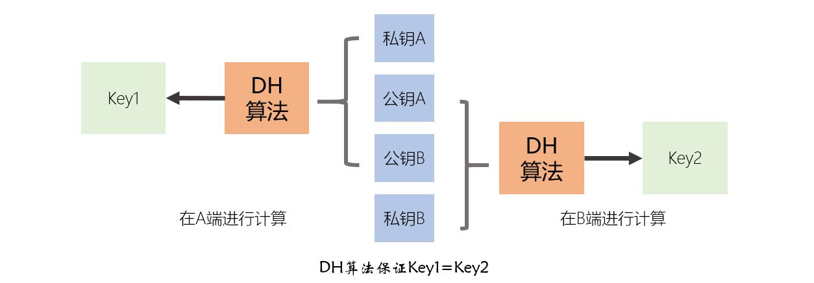

[《Python应用实战》视频课程](https://study.163.com/course/courseMain.htm?courseId=1209533804&share=2&shareId=400000000624093)

# 非对称加密算法(2)

难度：★★★★☆

## 算法实践(续)

#### 使用DSA算法进行数据签名与验证

- DSA算法仅能用于数字签名，不能用于加密与密钥交换
- DSA算法在相同的信息与私钥下，每次签名值也会不同

```python
from cryptography.hazmat.backends import default_backend
from cryptography.hazmat.primitives.asymmetric import dsa
from cryptography.hazmat.primitives import hashes
from cryptography.hazmat.primitives.asymmetric import utils

############
# 初始准备 #
############
# 要进行数字签名的信息
message = b"A message I want to sign"

# 签名方使用的私钥
private_key = dsa.generate_private_key(key_size=2048,
                                       backend=default_backend()
                                       )

# 验证方使用的公钥
public_key = private_key.public_key()

#######################################
# 进行数字签名：HASH与签名用一个函数完成 #
#######################################
signature = private_key.sign(message, hashes.SHA256())

##################################
# 进行数字签名：先HASH，然后再签名 #
##################################
chosen_hash = hashes.SHA256()
hasher = hashes.Hash(chosen_hash, default_backend())
hasher.update(message)
digest = hasher.finalize()

signature = private_key.sign(digest, utils.Prehashed(chosen_hash))

#########################################
# 数字签名验证：HASH与验证使用一个函数完成 #
#########################################
public_key.verify(signature, message, hashes.SHA256())

##############################
# 数字签名验证：先HASH，再验证 #
##############################
chosen_hash = hashes.SHA256()
hasher = hashes.Hash(chosen_hash, default_backend())
hasher.update(message)
digest = hasher.finalize()

public_key.verify(signature, digest, utils.Prehashed(chosen_hash))

```

#### 使用DH算法进行密钥交换



```python
from cryptography.hazmat.backends import default_backend
from cryptography.hazmat.primitives import hashes
from cryptography.hazmat.primitives.asymmetric import dh
from cryptography.hazmat.primitives.kdf.hkdf import HKDF

# 初始化DH算法的参数，这个过程比较慢，初始化的参数可以在未来多次使用
parameters = dh.generate_parameters(generator=2,
                                    key_size=2048,
                                    backend=default_backend()
                                    )

# 生成A端的私钥与公钥
private_key_A = parameters.generate_private_key()
public_key_A = private_key_A.public_key()

# 生成B端的私钥与公钥
private_key_B = parameters.generate_private_key()
public_key_B = private_key_B.public_key()

# 在A端计算shared_key，并基于此衍生出对称加密的密钥
shared_key_1 = private_key_A.exchange(public_key_B)
derived_key_1 = HKDF(algorithm=hashes.SHA256(),
                     length=32,
                     salt=None,
                     info=b'handshake data',
                     backend=default_backend()
                     ).derive(shared_key_1)

# 在B端计算shared_key
shared_key_2 = private_key_B.exchange(public_key_A)
derived_key_2 = HKDF(algorithm=hashes.SHA256(),
                     length=32,
                     salt=None,
                     info=b'handshake data',
                     backend=default_backend()
                     ).derive(shared_key_2)

```

一些附加说明：
- DH算法仅用于密钥交换，不用于数字签名
- DH私钥与公钥一般不保存，仅临时使用
- DH交换得到的密钥不建议长久使用，需要经常性的用新生成的公私钥对交换新的密钥

#### 椭圆曲线

- DSA与DH算法，在数学上都是基于素数域上的离散对数问题；椭圆曲线算法是基于某一个椭圆曲线域上的离散对数问题
- 在非对称加密算法中，有很多条可用的椭圆曲线
  + SECP192R1
  + SECP224R1
  + SECP256K1
  + SECP256R1
  + SECP384R1
  + SECP521R1
  + BRAINPOOLP256R1
  + BRAINPOOLP384R1
  + BRAINPOOLP512R1
  + SECT163K1
  + SECT163R2
  + SECT233K1
  + SECT233R1
  + SECT283K1
  + SECT283R1
  + SECT409K1
  + SECT409R1
  + SECT571K1
  + SECT571R1
  + Curve25519
  + Curve448
- 生成公私钥对必须基于指定的曲线
- 基于椭圆曲线的密钥交换算法称为ECDH，与DH架构类似
- 基于椭圆曲线的签名算法架构与DSA相似，但有两种不同的体系，ECDSA与EDDSA（其中椭圆曲线25519与448使用EDDSA）
- 椭圆曲线的密钥长度短，但强度与计算速度都优于其它非对称加密算法

```python
from cryptography.hazmat.backends import default_backend
from cryptography.hazmat.primitives.asymmetric import ec
from cryptography.hazmat.primitives import hashes
from cryptography.hazmat.primitives.asymmetric import utils
from cryptography.hazmat.primitives.kdf.hkdf import HKDF

############
# 数字签名 #
############
# 要进行数字签名的信息
message = b"A message I want to sign"

# 签名方使用的私钥
private_key = ec.generate_private_key(ec.SECP384R1(), default_backend())

# 验证方使用的公钥
public_key = private_key.public_key()

#######################################
# 进行数字签名：HASH与签名用一个函数完成 #
#######################################
signature = private_key.sign(message, ec.ECDSA(hashes.SHA256()))

##################################
# 进行数字签名：先HASH，然后再签名 #
##################################
chosen_hash = hashes.SHA256()
hasher = hashes.Hash(chosen_hash, default_backend())
hasher.update(message)
digest = hasher.finalize()

signature = private_key.sign(digest, ec.ECDSA(utils.Prehashed(chosen_hash)))

#########################################
# 数字签名验证：HASH与验证使用一个函数完成 #
#########################################
public_key.verify(signature, message, ec.ECDSA(hashes.SHA256()))

##############################
# 数字签名验证：先HASH，再验证 #
##############################
chosen_hash = hashes.SHA256()
hasher = hashes.Hash(chosen_hash, default_backend())
hasher.update(message)
digest = hasher.finalize()

public_key.verify(signature, digest, ec.ECDSA(utils.Prehashed(chosen_hash)))


############
# 密钥交换 #
############

# 生成A端的私钥与公钥
private_key_A = ec.generate_private_key(ec.SECP384R1(), default_backend())
public_key_A = private_key_A.public_key()

# 生成B端的私钥与公钥
private_key_B = ec.generate_private_key(ec.SECP384R1(), default_backend())
public_key_B = private_key_B.public_key()

# 在A端计算shared_key，并基于此衍生出对称加密的密钥
shared_key_1 = private_key_A.exchange(ec.ECDH(), public_key_B)
derived_key_1 = HKDF(algorithm=hashes.SHA256(),
                     length=32,
                     salt=None,
                     info=b'handshake data',
                     backend=default_backend()
                     ).derive(shared_key_1)

# 在B端计算shared_key
shared_key_2 = private_key_B.exchange(ec.ECDH(), public_key_A)
derived_key_2 = HKDF(algorithm=hashes.SHA256(),
                     length=32,
                     salt=None,
                     info=b'handshake data',
                     backend=default_backend()
                     ).derive(shared_key_2)

```

## 核心词汇

- `key exchange`

  密钥交换

- `DSA`

  Digital Signature Algorithm，数字签名算法

- `D-H`

  Diffie–Hellman key exchange，迪菲-赫尔曼密钥交换

- `elliptic curves`

  椭圆曲线

