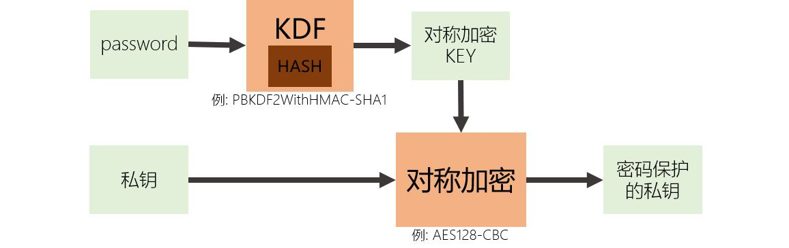

[《Python应用实战》视频课程](https://study.163.com/course/courseMain.htm?courseId=1209533804&share=2&shareId=400000000624093)

# 公钥与私钥的序列化

难度：★★★★★

## 什么是序列化

所谓序列化，就是将变量转化为bytes类型的过程，转化后可以进行存储与传输。

```python

v = [{"name": "Alice","age": 12},
     {"name": "Bob","age": 13}
    ]

import json
json.dumps(v).encode()

import yaml
yaml.dump(v).encode()
```

信息的序列化过程：

- 信息结构定义

  *asn.1是描述结构定义的一种标准*

- 编码方式


## 公钥与私钥的序列化

#### 常用公私钥编码方式

- **PEM**

  PEM是一种可读字符串编码方式，以行`-----BEGIN x-----`开始，以行`-----END x-----`结束（x为公私钥或者其它类型）

```pem
-----BEGIN PUBLIC KEY-----
MIIBIDCBlQYJKoZIhvcNAQMBMIGHAoGBAPz/NMeHgAwuA01Wr9b3zBP9+Mj3hkcL
pEaU/n+uHbhta1EjTgqf1sS/Vdv/pX8D4xJlBwlMNeQxZMLbtKjNdVY5nuRYaChb
8qKS6kBHIc4UTZTXapm24bQHUztbwrqGlAlgzMzNAusAnVSm0Uo5GbZYYD8jcjpM
cunmlrTrYgajAgECA4GFAAKBgQCI/sSDoN2QwGWttMLG48n+BK4AI8EkRdZwpjwI
wUFbLjFiZaNt3HiezVvYZgWky7HZWHV2m2hy/xLlYYJFMHFaJKF7G7+V5hSWRvay
62gpfyzME8CXrencj4jxx4e5eOhAoTl5Dg8D0Sp8UZLl1CrFTfLP+eaK5XopUTjA
I5sZkg==
-----END PUBLIC KEY-----
```

- **DER**

  DER是一种二进制编码方式

- PKCS12

  PKCS12是一种二进制编码方式，由[RFC 7292](https://tools.ietf.org/html/rfc7292.html)定义。

*注：以上几种编码格式，既可以用于公钥、私钥的序列化，也可以用于证书的序列化*

- OpenSSH

  OpenSSH是一种可读字符串编码定义，仅用于公钥的序列化，仅可对应使用OpenSSH结构定义

```
ssh-rsa AAAAB3NzaC1yc2EAAAADAQABAAABAQDDu/XRP1kyK6Cgt36gts9XAk
FiiuJLW6RU0j3KKVZSs1I7Z3UmU9/9aVh/rZV43WQG8jaR6kkcP4stOR0DEtll
PDA7ZRBnrfiHpSQYQ874AZaAoIjgkv7DBfsE6gcDQLub0PFjWyrYQUJhtOLQEK
vY/G0vt2iRL3juawWmCFdTK3W3XvwAdgGk71i6lHt+deOPNEPN2H58E4odrZ2f
sxn/adpDqfb2sM0kPwQs0aWvrrKGvUaustkivQE4XWiSFnB0oJB/lKK/CKVKuy
///ImSCGHQRvhwariN2tvZ6CBNSLh3iQgeB0AkyJlng7MXB2qYq/Ci2FUOryCX
2MzHvnbv testkey@localhost
```


#### 公钥的信息结构定义

- **SubjectPublicKeyInfo**

  这是最常用的一种公钥结构定义

- OpenSSH

  这种结构定义的信息仅能使用编码定义OpenSSH

- PKCS1

  仅能用于RSA公钥

*对于椭圆曲线类算法的公钥，在结构定义中还需要选择是否CompressedPoint*

```python
######################
# 使用Cryptography库 #
######################
from cryptography.hazmat.backends import default_backend
from cryptography.hazmat.primitives import serialization
from cryptography.hazmat.primitives.asymmetric import dsa
from cryptography.hazmat.primitives.serialization import load_pem_public_key

private_key = dsa.generate_private_key(key_size=1024, backend=default_backend())
public_key = private_key.public_key()

# 序列化公钥
dsa_pub_serialized = public_key.public_bytes(
                           encoding=serialization.Encoding.PEM, 
                           format=serialization.PublicFormat.SubjectPublicKeyInfo
                           )

# 公钥反序列化
public_key_got = load_pem_public_key(dsa_pub_serialized, backend=default_backend())

######################
# 使用PyCryptodome库 #
######################
from Crypto.PublicKey import DSA
private_key = DSA.generate(1024)
public_key = private_key.publickey()

# 序列化公钥
dsa_pub_serialized = public_key.export_key(format='PEM')

# 公钥反序列化
public_key_got = DSA.import_key(dsa_pub_serialized)
```

*注：PyCryptodome库中公钥仅支持SubjectPublicKeyInfo一种结构，所以没有相关参数设置*


#### 私钥的信息结构定义

- **PKCS8**

  目前建议使用的私钥结构定义。

- TraditionalOpenSSL(如果是RSA私钥，与PKCS1一致)



```python
######################
# 使用Cryptography库 #
######################
from cryptography.hazmat.backends import default_backend
from cryptography.hazmat.primitives import serialization
from cryptography.hazmat.primitives.asymmetric import rsa
from cryptography.hazmat.primitives.serialization import load_der_private_key

private_key = rsa.generate_private_key(public_exponent=65537,
                                       key_size=2048,
                                       backend=default_backend()
                                       )

# 序列化私钥
rsa_pri_serialized = private_key.private_bytes(
                         encoding=serialization.Encoding.DER,
                         format=serialization.PrivateFormat.PKCS8,
                         encryption_algorithm=serialization.BestAvailableEncryption(b'mypassword')
                         )

# 私钥反序列化
private_key_got = load_der_private_key(rsa_pri_serialized, password=b'mypassword', backend=default_backend())


######################
# 使用PyCryptodome库 #
######################
from Crypto.PublicKey import RSA
private_key = RSA.generate(2048)

# 序列化私钥
rsa_pri_serialized = private_key.export_key(
                         format='DER',
                         pkcs=8,
                         passphrase='mypassword',
                         protection="PBKDF2WithHMAC-SHA1AndAES128-CBC"
                         )

# 私钥反序列化
private_key_got = RSA.import_key(rsa_pri_serialized, passphrase='mypassword')
```


## 核心词汇

- `Serialization`

  序列化

- `ASN.1`

  Abstract Syntax Notation One，它提供了一套用于描述信息结构的标准表达方式

- `PKCS`

  Public Key Cryptography Standards，公钥密码学标准，由RSA信息安全公司所制定


**大家可以尝试完成[《习题》](习题.md)中第二题，以验证你对本视频内容的掌握。**
