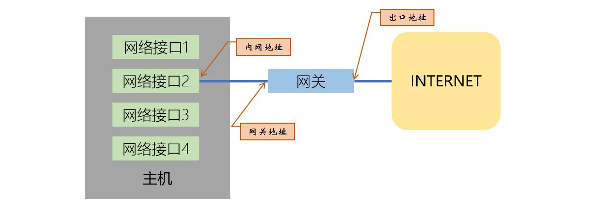
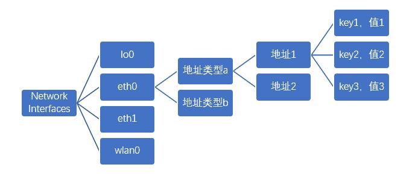

[《Python应用实战》视频课程](https://study.163.com/course/courseMain.htm?courseId=1209533804&share=2&shareId=400000000624093)

# 从网卡到地理位置

难度：★★☆☆☆



- [netifaces](https://github.com/al45tair/netifaces)库

  `pip install netifaces`

  一个跨平台的获得主机网络信息的库

- [IPAPI](https://ipapi.co/api/)服务

  IPAPI提供从公网IP地址获取相关地理信息的服务

## 网络接口(interface)信息



```python
import netifaces
import yaml

for ni in netifaces.interfaces():
    print('[网络接口：%s]'%ni)
    for addrn in netifaces.ifaddresses(ni):
        print(netifaces.address_families[addrn] + ":")
        print(yaml.dump(netifaces.ifaddresses(ni)[addrn]))
```

## 网关信息

```python
import netifaces

# 打印所有的网关信息
print("网关信息：")
for addrn in netifaces.gateways():
    if addrn!='default':
        print(netifaces.address_families[addrn] + ":")
        for gw in netifaces.gateways()[addrn]:
            print("\t地址：\t\t", gw[0])
            print("\t网络接口：\t", gw[1])
            print("\t是否缺省：\t", gw[2])

# 打印缺省网关信息
print("缺省网关：")
for addrn, addr in netifaces.gateways()['default'].items():
    print(netifaces.address_families[addrn] + ":")
    print("\t地址：\t\t", addr[0])
    print("\t网络接口：\t", addr[1])

```

## 获得内网地址

```python
import socket

def get_local_ip() -> str:
    """获得主机实际使用的内网地址."""
    try:
        sock = socket.socket(socket.AF_INET, socket.SOCK_DGRAM)
        sock.connect(("8.8.8.8", 80))
        return sock.getsockname()[0]
    except socket.error:
        try:
            return socket.gethostbyname(socket.gethostname())
        except socket.gaierror:
            return "127.0.0.1"
    finally:
        sock.close()
```

## 获得出口地址

使用[ipapi](https://github.com/ipapi-co/ipapi-python)库访问[IPAPI](https://ipapi.co/api/)服务

`pip install ipapi`

```python
import ipapi
ipapi.location(field='ip')  
```

## 从出口地址推出更多信息

```python
import ipapi
ipapi.location(ip=None)

ipapi.location(ip='8.8.8.8')
```

- 时区
- 国家
- 地区（省）
- 城市
- 时区
- 货币
- 语言
- 经纬度

## 概念词汇

- `network interface`

  网络接口

- `address_families`

  地址类型

- `gateway`

  网关
