[《Python应用实战》视频课程](https://study.163.com/course/courseMain.htm?courseId=1209533804&share=2&shareId=400000000624093)

# GUI与Tcl/Tk(1)

难度：★★★☆☆

## Tcl/Tk与tkinter

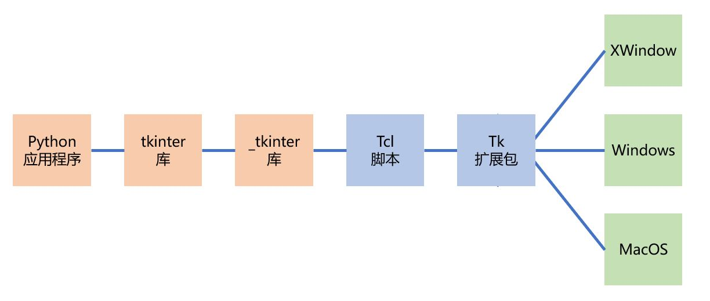

测试运行：

`python -m tkinter`

## Python中其它的GUI库

- tkinter的缺点：
  1. 界面不够美观与现代
  2. 参考文档不够清晰

- 其它一些GUI库
  - [PyQt](https://riverbankcomputing.com/software/pyqt/intro)
  - [wxPython](https://www.wxpython.org/)
  - [PyGObject](https://wiki.gnome.org/Projects/PyGObject)
  - [PySide](https://wiki.qt.io/PySide)

## Hello, World!

```python
import tkinter
root = tkinter.Tk()

##################################
# 此处定义用户界面的各种显示与逻辑 #
##################################
label = tkinter.Label(root, text="Hello, World!")
label.pack()

root.mainloop()
```

## 一些常用的Widget

- Label

  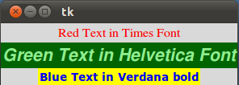

- Message

  

- Button

  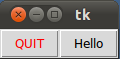

- Radiobutton

  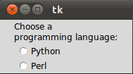

- Checkbutton

  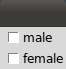

- Entry

  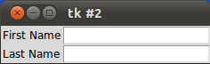

- Canvas

  

- Scale

  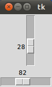

- Menu

  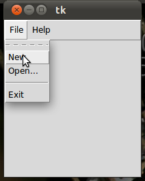

- dialog

    - messagebox

  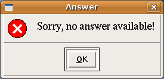

  - filedialog

  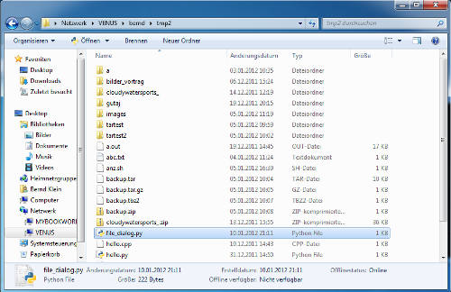

  - colorchooser

  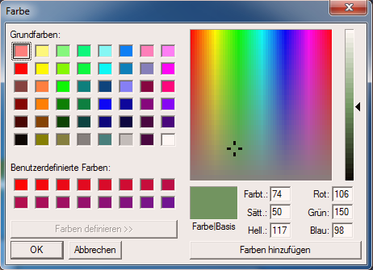

- Frame

## Widget的树状组织

  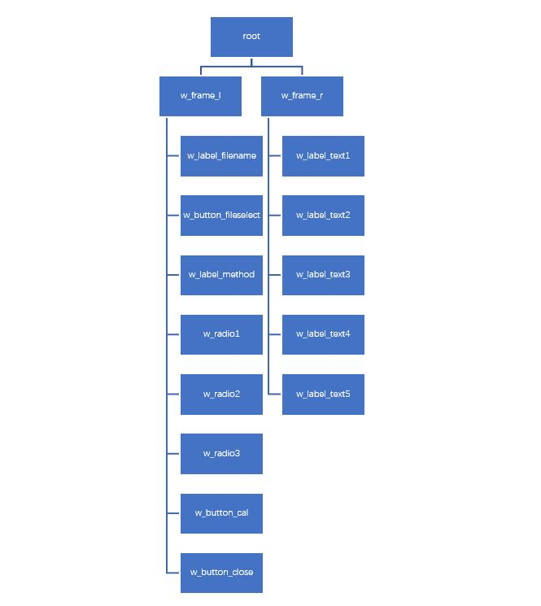
  ```python
  import tkinter as tk

  # 整个窗口
  root = tk.Tk()

  # 树状结构组织的widget
  w_frame_l = tk.Frame(root)
  w_frame_r = tk.Frame(root)
  w_label_filename = tk.Label(w_frame_l)
  w_button_fileselect = tk.Button(w_frame_l)
  w_label_method = tk.Label(w_frame_l)
  w_radio1 = tk.Radiobutton(w_frame_l)
  w_radio2 = tk.Radiobutton(w_frame_l)
  w_radio3 = tk.Radiobutton(w_frame_l)
  w_button_cal = tk.Button(w_frame_l)
  w_button_close = tk.Button(w_frame_l)
  w_label_text1 = tk.Label(w_frame_r)
  w_label_text2 = tk.Label(w_frame_r)
  w_label_text3 = tk.Label(w_frame_r)
  w_label_text4 = tk.Label(w_frame_r)
  w_label_text5 = tk.Label(w_frame_r)

  # 显示widget
  w_frame_l.pack()
  w_frame_r.pack()
  w_label_filename.pack()
  w_button_fileselect.pack()
  w_label_method.pack()
  w_radio1.pack()
  w_radio2.pack()
  w_radio3.pack()
  w_button_cal.pack()
  w_button_close.pack()
  w_label_text1.pack()
  w_label_text2.pack()
  w_label_text3.pack()
  w_label_text4.pack()
  w_label_text5.pack()

  root.mainloop()

  ```

## widget的属性

  ```python
  import tkinter as tk

  FILENAME = "c:/learn_python/test.py"
  HASH = "35d3eed56aa64399e6187e03347542d3dab24451f46b7c92395ecdb7cb9e0f1f"

  # 整个窗口
  root = tk.Tk()
  root.title("计算文件HASH值")
  root.maxsize(1600, 800)

  # 左右两个frame
  w_frame_l = tk.Frame(root, bg="#e0f8f8")
  w_frame_r = tk.Frame(root)

  # 显示选择的文件名
  w_label_filename = tk.Label(w_frame_l,
                              bg= "#e0f8f8",
                              fg='green',
                              font=('times', 16, 'italic'),
                              text=FILENAME)

  # 文件选择按钮
  w_button_fileselect = tk.Button(w_frame_l, text="选择文件", font=('times', 16))
  w_button_fileselect.config(width=40)

  # 算法标题
  w_label_method = tk.Label(w_frame_l,
                            bg="#e0f8f8",
                            font=('times', 20),
                            text="算法：")

  # 算法单选钮
  w_radio1 = tk.Radiobutton(w_frame_l, text="MD5", bg="#e0f8f8", font=('times', 16))
  w_radio2 = tk.Radiobutton(w_frame_l, text="SHA256", bg="#e0f8f8", font=('times', 16))
  w_radio3 = tk.Radiobutton(w_frame_l, text="BLAKE2b256", bg="#e0f8f8", font=('times', 16))

  # 计算按钮
  w_button_cal = tk.Button(w_frame_l, text="计算", width=15, font=('times', 16))

  # 关闭按钮
  w_button_close = tk.Button(w_frame_l, text="关闭",width=15, font=('times', 16))

  # 计算结果标题
  w_label_text1 = tk.Label(w_frame_r,
                           font=('times',40),
                           text="计算结果")

  # 文件标题
  w_label_text2 = tk.Label(w_frame_r,
                           font=('times', 20 ),
                           text="文件:")

  # 选择的文件名
  w_label_text3 = tk.Label(w_frame_r,
                           fg='red',
                           font=('times', 20, 'italic' ),
                           text=FILENAME)

  # HASH值标题
  w_label_text4 = tk.Label(w_frame_r,
                           font=('times', 20 ),
                           text="哈希值:")

  # 计算获得的结果
  w_label_text5 = tk.Label(w_frame_r,
                           fg='red',
                           font=('times', 16, 'italic' ),
                           text=HASH)

  # 显示widget
  w_frame_l.pack()
  w_frame_r.pack()
  w_label_filename.pack()
  w_button_fileselect.pack()
  w_label_method.pack()
  w_radio1.pack()
  w_radio2.pack()
  w_radio3.pack()
  w_button_cal.pack()
  w_button_close.pack()
  w_label_text1.pack()
  w_label_text2.pack()
  w_label_text3.pack()
  w_label_text4.pack()
  w_label_text5.pack()

  root.mainloop()
  ```

## widget的排版

三种排版方式：
- pack
- grid
- place

  ```python
  w_frame_l.pack(side=tk.LEFT)
  w_frame_r.pack(side=tk.LEFT, fill=tk.Y)
  w_label_filename.pack(fill=tk.X)
  w_button_fileselect.pack(padx=100,pady=20)
  w_label_method.pack(anchor=tk.W, padx=20, pady=20)
  w_radio1.pack(anchor=tk.W, padx=50)
  w_radio2.pack(anchor=tk.W, padx=50)
  w_radio3.pack(anchor=tk.W, padx=50)
  w_button_cal.pack(side=tk.LEFT, padx=100, pady=50)
  w_button_close.pack(side=tk.RIGHT, padx=100, pady=50)
  w_label_text1.pack(anchor=tk.S, pady=40)
  w_label_text2.pack(anchor=tk.W, padx=30)
  w_label_text3.pack(anchor=tk.N, pady=20)
  w_label_text4.pack(anchor=tk.W, padx=30, pady=20)
  w_label_text5.pack(anchor=tk.N, padx=50, pady=20)
  ```


## 概念词汇

- `GUI`

  Graphical User Interface，用户图形接口

- `widget`

  小部件

- `frame`

  框架，帧
