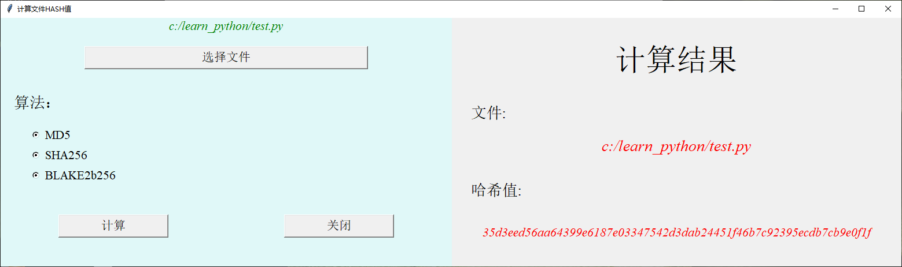
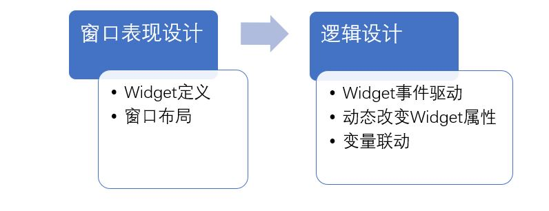

[《Python应用实战》视频课程](https://study.163.com/course/courseMain.htm?courseId=1209533804&share=2&shareId=400000000624093)

# GUI与Tcl/Tk(2)

难度：★★★☆☆

## 程序与widget的互动

- 根据widget中发生的事件，调用函数

- 在程序中改变widget的属性，从而改变它的显示



## Widget中的事件驱动

```python
def get_filename():
    print("打开文件按钮被触发！")

def cal_hash():
    print("计算HASH按钮被触发！")

w_button_fileselect = tk.Button(w_frame_l, text="选择文件", font=('times', 16),
                                command=get_filename)
w_button_cal = tk.Button(w_frame_l, text="计算", width=15, font=('times', 16),
                         command=cal_hash)
w_button_close = tk.Button(w_frame_l, text="关闭",width=15, font=('times', 16),
                           command=root.destroy)
```

## 改变Widget的属性

```python
def get_filename():
    print("打开文件按钮被触发！")
    w_label_filename.config(text='xxxxxxxxxxxxxxxxx')
    w_label_text3.config(text='yyyyyyyyyyyyyyyy')

def cal_hash():
    print("计算HASH按钮被触发！")
    w_label_text5.config(fg='blue')
```

## 变量联动机制

```python
FILENAME = tk.StringVar()
HASH = tk.StringVar()
METHOD = tk.IntVar()

w_label_filename = tk.Label(w_frame_l,
                            bg= "#e0f8f8",
                            fg='green',
                            font=('times', 16, 'italic'),
                            textvariable=FILENAME)
w_label_text3 = tk.Label(w_frame_r,
                         fg='red',
                         font=('times', 20, 'italic' ),
                         textvariable=FILENAME)

w_label_text5 = tk.Label(w_frame_r,
                         fg='red',
                         font=('times', 16, 'italic' ),
                         textvariable=HASH)

w_radio1 = tk.Radiobutton(w_frame_l, text="MD5", bg="#e0f8f8", font=('times', 16),
                          variable=METHOD, value=1)
w_radio2 = tk.Radiobutton(w_frame_l, text="SHA256", bg="#e0f8f8", font=('times', 16),
                          variable=METHOD, value=2)
w_radio3 = tk.Radiobutton(w_frame_l, text="BLAKE2b256", bg="#e0f8f8", font=('times', 16),
                          variable=METHOD, value=3)

```

- 联动变量必须使用tkinter中对应的函数进行初始化
- 联动变量的值获取使用`get()`函数，设置使用`set()`函数

## 对话框widget

```python
from tkinter import filedialog, messagebox

def get_filename():
    name= filedialog.askopenfilename()
    FILENAME.set(name)
    HASH.set('')

def cal_hash():
    if not FILENAME.get():
        messagebox.showwarning("警告","请先选择文件!")
        return
    r = file_hash( FILENAME.get(), METHOD.get())
    HASH.set(r)
```

[最终的程序](programs/file_hash.py)

## tkinter开发



- 更多的一些资料

    + [tkinter基础教程](https://www.python-course.eu/tkinter_labels.php)
    + [tkinter一些widget与函数参考](https://www.tutorialspoint.com/python/python_gui_programming.htm)
    + [Python官方的tkinter文档](https://docs.python.org/3/library/tk.html)
    + [tkinter库主文件源代码](https://github.com/python/cpython/blob/3.8/Lib/tkinter/__init__.py)
    + [tkinter.ttk](https://docs.python.org/3/library/tkinter.ttk.html)
