[《Python应用实战》视频课程](https://study.163.com/course/courseMain.htm?courseId=1209533804&share=2&shareId=400000000624093)

# PyQT基础概念与使用

难度：★★★☆☆

## 安装

- Windows

  `pip install PyQt5`

- 树莓派

  `sudo apt-get install pyqt5-dev-tools`

- MacOS

  `brew install pyqt5`

## Hello, World!

```python
from PyQt5.QtWidgets import QApplication, QLabel

# 所有pyqt应用都必须有且仅有一个QApplication实例
# 传入参数一般为命令行参数，[]代表没有命令行参数
app = QApplication([])

# 初始化一个QLabel类型的Widget
label = QLabel('Hello World!')

# 显示
label.show()

# 将控制权交给QT，直到窗口关闭
app.exec_()
```

- 应用需要初始化一个QApplication实例，并在窗口显示后调用其exec_()方法
- 界面由各种Widget组成，每个Widget有各种可以设置的属性、以及可以调用的方法
- Signal/Slot机制是QT中独特的一种事件驱动机制

## 一些常用的Widget

- [QLabel](https://www.tutorialspoint.com/pyqt/pyqt_qlabel_widget.htm)

  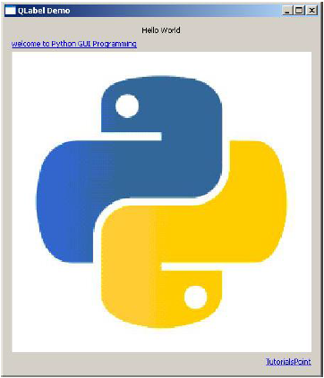

- [QLineedit](https://www.tutorialspoint.com/pyqt/pyqt_qlineedit_widget.htm)

  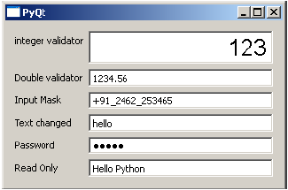

- [QPushButton](https://www.tutorialspoint.com/pyqt/pyqt_qpushbutton_widget.htm)

  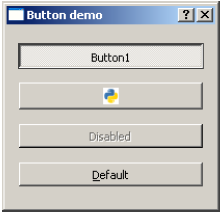

- [QRadioButton](https://www.tutorialspoint.com/pyqt/pyqt_qradiobutton_widget.htm)

  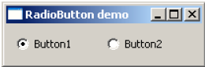

- [QCheckBox](https://www.tutorialspoint.com/pyqt/pyqt_qcheckbox_widget.htm)

  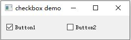

- [QComboBox](https://www.tutorialspoint.com/pyqt/pyqt_qcombobox_widget.htm)

  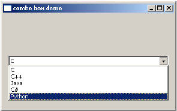

- [QSpinBox](https://www.tutorialspoint.com/pyqt/pyqt_qspinbox_widget.htm)

  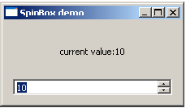

- [QSlider](https://www.tutorialspoint.com/pyqt/pyqt_qslider_widget_signal.htm)

  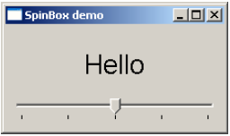

- [QMenuBar](https://www.tutorialspoint.com/pyqt/qmenubar_qmenu_qaction_widgets.htm)

  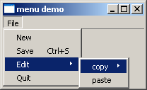

- [QToolBar](https://www.tutorialspoint.com/pyqt/pyqt_qtoolbar_widget.htm)

  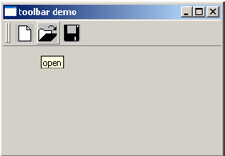

- [QInputDialog](https://www.tutorialspoint.com/pyqt/pyqt_qinputdialog_widget.htm)

  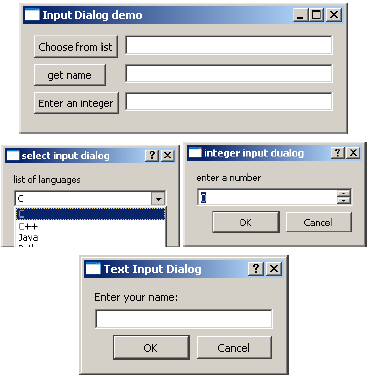

- [QFontDialog](https://www.tutorialspoint.com/pyqt/pyqt_qfontdialog_widget.htm)

  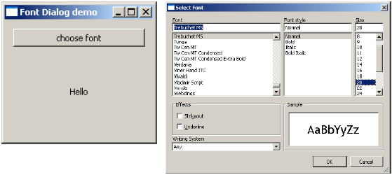

- [QFileDialog](https://www.tutorialspoint.com/pyqt/pyqt_qfiledialog_widget.htm)

  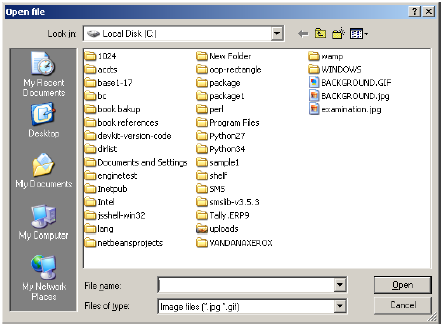

- [QTab](https://www.tutorialspoint.com/pyqt/pyqt_qtabwidget.htm)

  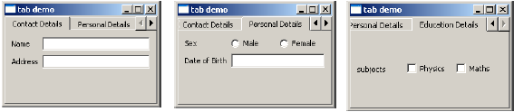

- [QStacked](https://www.tutorialspoint.com/pyqt/pyqt_qstackedwidget.htm)

  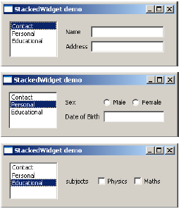

- [QSplitter](https://www.tutorialspoint.com/pyqt/pyqt_qsplitter_widget.htm)

  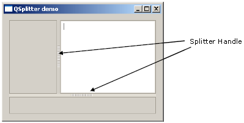

- [QDock](https://www.tutorialspoint.com/pyqt/pyqt_qdockwidget.htm)

  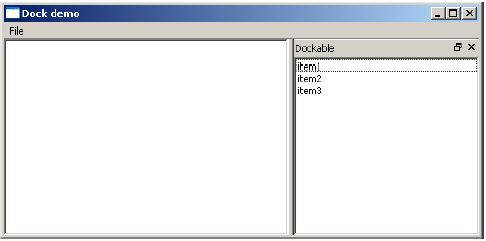

- [QStatusBar](https://www.tutorialspoint.com/pyqt/pyqt_qstatusbar_widget.htm)

  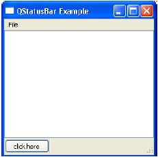

- [QList](https://www.tutorialspoint.com/pyqt/pyqt_qlistwidget.htm)

  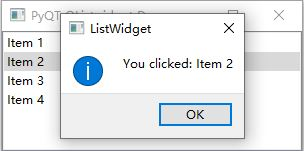

- [QScrollBar](https://www.tutorialspoint.com/pyqt/pyqt_qscrollbar_widget.htm)

  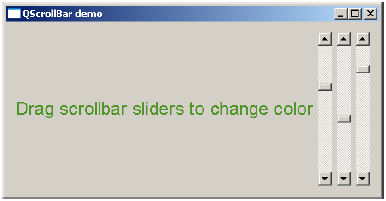

- [QCalendar](https://www.tutorialspoint.com/pyqt/pyqt_qcalender_widget.htm)

  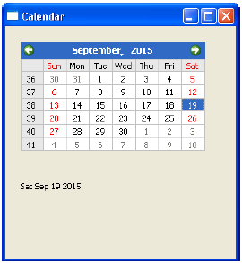

```python
from PyQt5.QtCore import *
from PyQt5.QtWidgets import *
from PyQt5.QtGui import *

app = QApplication([])
win = QWidget()

##########
# 输入框 #
##########
e = QLineEdit('18RKfuiBLFAq86dwyfUmX5gvFFZFYSMwgw', win)
e.setFont(QFont("Arial",15))
e.setMaxLength(50)
e.move(20,20)

########
# 按钮 #
########
b = QPushButton("查询",win)
b.move(210,20)

############
# 文字显示 #
############
l = QLabel("余额：500 satoshi",win)
l.setFont(QFont("Arial",20))
l.move(20,100)

win.setWindowTitle("比特币账户余额查询")
win.setGeometry(100,100,500,300)
win.show()

app.exec_()
```

## 布局（layout）

- [QBoxLayout](https://www.tutorialspoint.com/pyqt/pyqt_qboxlayout_class.htm)

  Widget水平或垂直排布。水平和垂直布局分别对应子类`QHBoxLayout`与`QVBoxLayout`。

- [QGridLayout](https://www.tutorialspoint.com/pyqt/pyqt_qgridlayout_class.htm)

  Widget的表格状布局。在添加每个Widget时，指定行与列。

- [QFormLayout](https://www.tutorialspoint.com/pyqt/pyqt_qformlayout_class.htm)

  一般用于创建两列的表：左边是label，右边是输入项。

```python
from PyQt5.QtCore import *
from PyQt5.QtWidgets import *
from PyQt5.QtGui import *

app = QApplication([])
win = QWidget()

e = QLineEdit('18RKfuiBLFAq86dwyfUmX5gvFFZFYSMwgw', win)
e.setFont(QFont("Arial",15))
e.setMaxLength(50)

b = QPushButton("查询",win)

l = QLabel("余额：500 satoshi",win)
l.setFont(QFont("Arial",20))

##########
## 布局  #
##########
vbox =QVBoxLayout()
vbox.addWidget(e)
vbox.addWidget(b)
fbox = QFormLayout()
fbox.addRow(QLabel("地址"),vbox)
fbox.addRow(QLabel(""))
fbox.addRow(QLabel(""))
fbox.addRow(l)
win.setLayout(fbox)

win.setWindowTitle("比特币账户余额查询")
win.setGeometry(100,100,500,300)
win.show()

app.exec_()
```

## 风格

- 显示支持的风格

  ```python
  from PyQt5.QtWidgets import QStyleFactory
  print(QStyleFactory.keys())
  ```

- 设置风格

  ```python
  from PyQt5.QtWidgets import *
  app = QApplication([])
  app.setStyle('Fusion')
  ```

- 设置颜色

  ```python
  palette = QPalette()
  palette.setColor(QPalette.ButtonText, Qt.red)
  app.setPalette(palette)
  ```

## 信号与槽（signal&slot）

*信号就是事件，槽就是事件对应的处理函数。*

```python
from PyQt5.QtCore import *
from PyQt5.QtWidgets import *
from PyQt5.QtGui import *
from bit.network import NetworkAPI

def get_account():
    addr = e.text()
    unspents = NetworkAPI.get_unspent(addr)
    s=sum(unspent.amount for unspent in unspents)
    l.setText( "余额：%d satoshi"%s )

app = QApplication([])
win = QWidget()

e = QLineEdit('18RKfuiBLFAq86dwyfUmX5gvFFZFYSMwgw', win)
e.setFont(QFont("Arial",15))
e.setMaxLength(50)

b = QPushButton("查询",win)
#############
## 信号与槽  #
#############
b.clicked.connect(get_account)

l = QLabel("余额：500 satoshi",win)
l.setFont(QFont("Arial",20))

##########
## 布局  #
##########
vbox =QVBoxLayout()
vbox.addWidget(e)
vbox.addWidget(b)
fbox = QFormLayout()
fbox.addRow(QLabel("地址"),vbox)
fbox.addRow(QLabel(""))
fbox.addRow(QLabel(""))
fbox.addRow(l)
win.setLayout(fbox)

win.setWindowTitle("比特币账户余额查询")
win.setGeometry(100,100,500,300)
win.show()

app.exec_()

```

## 概念词汇

- `widget`

  窗口小部件

- `layout`

  布局

- `style`

  风格

- `signal`

  信号

- `slot`

  槽

