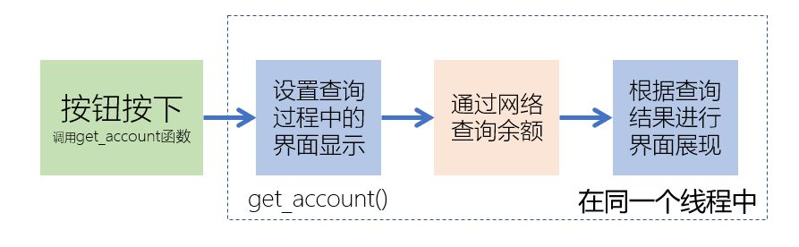
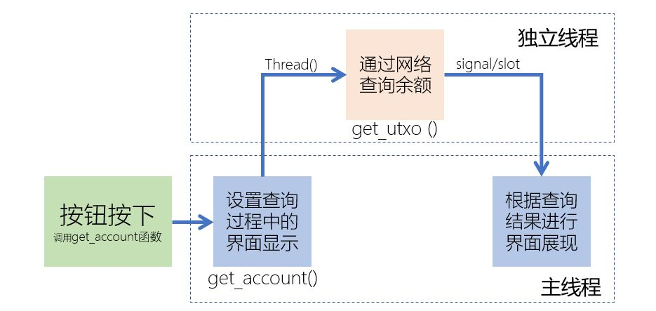
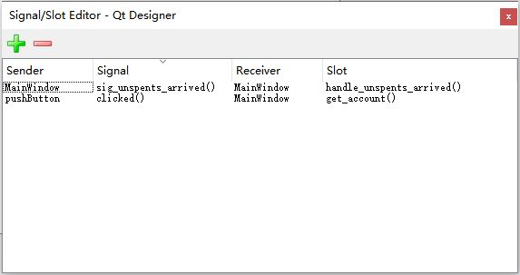
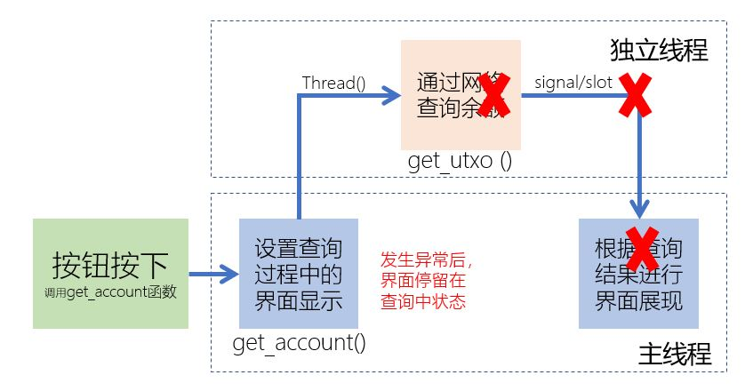

[《Python应用实战》视频课程](https://study.163.com/course/courseMain.htm?courseId=1209533804&share=2&shareId=400000000624093)

# QtDesigner(2)

难度：★★★★☆

## 界面阻塞的原因



```python
    def get_account(self):
        # 查询时界面设置
        self.label_2.setText( '查询中......' )
        self.pushButton.setEnabled(False)
        self.treeWidget.setHidden(True)

        # 网络查询余额
        addr = self.lineEdit.text()
        unspents = NetworkAPI.get_unspent(addr)

        # 查询后界面展现
        self.pushButton.setEnabled(True)
        if len(unspents)==0:
            self.label_2.setText( '<html><head/><body><p><span style=" color:#00aa00;">0</span></p></body></html>' )
        ......
```

*原因：在单线程中执行了会阻塞的函数*

## 以独立线程运行阻塞操作



[bitcoin_alpha.ui](programs/bitcoin_alpha.ui)

[bitcoin_beta1.py](programs/bitcoin_beta1.py)

## 在QT Designer中设置signal/slot

*将signal/slot的设置放在QT Designer中，简化程序*

~~`self.pushButton.clicked.connect(self.get_account)`~~

~~`self.sig_unspents_arrived.connect(self.handle_unspents_arrived)`~~




[bitcoin_beta.ui](programs/bitcoin_beta.ui)

[bitcoin_beta2.py](programs/bitcoin_beta2.py)


## 处理异常



- 问题：当网络访问出现异常时，按钮已经disable，界面无法再继续工作
- 解决：对异常进行处理，出现异常时继续执行

[bitcoin_beta.ui](programs/bitcoin_beta.ui)

[bitcoin_beta3.py](programs/bitcoin_beta3.py)
