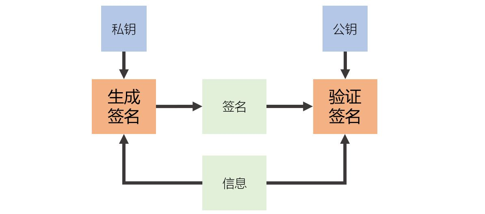
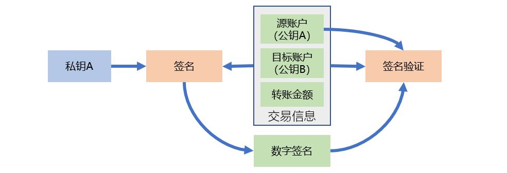
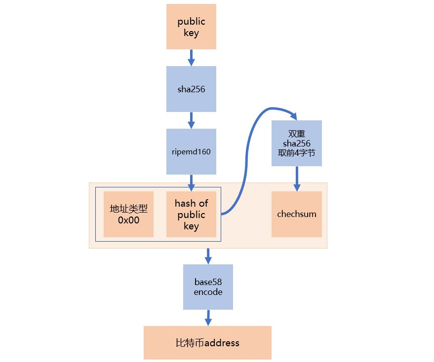

[《Python应用实战》视频课程](https://study.163.com/course/courseMain.htm?courseId=1209533804&share=2&shareId=400000000624093)

# 比特币账户地址

难度：★★★☆☆

## 关于本篇章

- 以逻辑串联各种概念
- 从用户视角到货币发行视角
- 从表象到具体实现
- 由浅入深、循序渐进

*比特币的实现，大量应用到现代加密学，如果你对现代加密学还不了解的话，建议先学习[《加密》](../04.加密/)篇章，特别是其中的[《HASH函数》](../04.加密/2.HASH函数与文件HASH值.md)、[《非对称加密算法(1)》](../04.加密/7.非对称加密算法(1).md)与[《非对称加密算法(2)》](../04.加密/8.非对称加密算法(2).md)。*

## 匿名账户的实现原理

非对称加密算法：

- 公钥公开、私钥机密、从公钥无法推导出私钥
- 生成数字签名

  输入：私钥与被签名的信息

  输出：签名值

- 数字签名验证

  输入：公钥、被签名的信息、签名值

  输出：签名是否正确

假设将公钥作为账户名：

- 交易的源与目标都是账户名（公钥）
- 私钥是使用账户的凭证，私钥对交易信息进行签名
- 交易的有效性验证：
  + 交易源账户是否有足够的钱
  + 交易签名是否正确

操作体验：

1. 无需在系统中注册，直接生成自己的账户供使用
2. 生成账户的过程，就是生成一对非对称加密算法的公私钥对，这个过程可以是离线完成的
3. 账户名给任何需要给这个账户转入钱款的人
4. 通过自己掌握的私钥可以操作自己的账户

**一旦你的私钥泄露，也就意味着别人能操作你的账户**

**一旦你的私钥丢失，也就意味着你丢失了对账户的操作权，而且没有办法找回**

*匿名账户的实现逻辑与区块链概念没有关系！*

## 比特币地址

- 使用椭圆曲线非对称加密算法（曲线[secp256k1](https://en.bitcoin.it/wiki/Secp256k1)）
- 比特币地址生成

- base58编码

  字符集：`123456789ABCDEFGHJKLMNPQRSTUVWXYZabcdefghijkmnopqrstuvwxyz`

  在10个数字，26个字母大小写基础上，去除：`0`、`O`、`I`、`l`

- 地址类型

  PublicKeyHash仅是类型`0x00`时地址的含义，不同的类型的地址对应的含义会不同

  因为首字节为`0x00`的字节串，base58编码后必然以`1`开头，所以这种类型的比特币地址，也是以`1`开头的字符串

- 校验码

  双重sha256 hash计算后，取前四个字节

- 地址中仅包含PublicKey的hash

    因为是PublicKey的hash，所以在签名值必须附上PublicKey——由PublicKeyHash验证PublicKey是否正确，再由PublicKey验证签名是否正确

体验一下比特币账户的生成：

**[bitaddress.org](https://www.bitaddress.org/)**