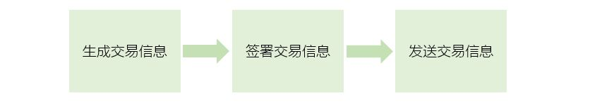
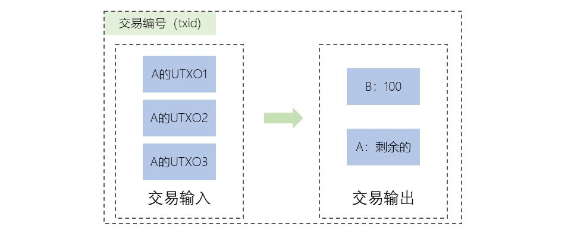
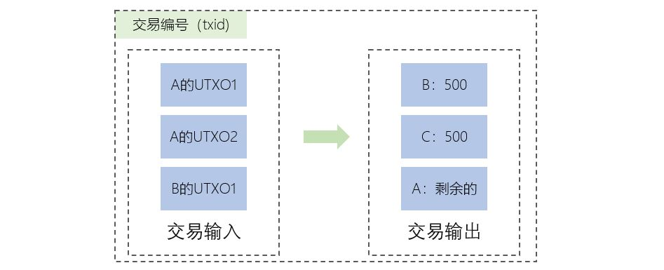

[《Python应用实战》视频课程](https://study.163.com/course/courseMain.htm?courseId=1209533804&share=2&shareId=400000000624093)

# 比特币账户操作(2)

难度：★★★☆☆

## Testnet

一个全球性的比特币测试环境，在其中获得和花费的比特币没有实际价值。

生成在Testnet中的密钥与地址
```python
import bit
from bit.network import NetworkAPI

key=bit.PrivateKeyTestnet()
key.address 

# 获得UTXO与余额
key.get_unspents()
key.get_balance()

# 仅通过地址获得UTXO
from bit.network import NetworkAPI
unspents = NetworkAPI.get_unspent_testnet(key.address)
sum(unspent.amount for unspent in unspents)

# 准备三个Testnet中的比特币账户
keyA = key
keyB = bit.PrivateKeyTestnet()
keyC = bit.PrivateKeyTestnet()
```

- Testnet中比特币地址类型（PublickeyHash）是`0x6f`
- 可以从以下地址申请Testnet中的比特币
    + [https://coinfaucet.eu/en/btc-testnet/](https://coinfaucet.eu/en/btc-testnet/)

## 交易




```python
import bit
from bit.network import NetworkAPI
from bit.transaction import calc_txid

######################
# A转移100satoshi给B #
######################

# 交易信息
tx_data = bit.PrivateKeyTestnet.prepare_transaction(
                unspents=keyA.get_unspents(),
                outputs=[(keyB.address, 100, 'satoshi')],
                leftover=keyA.address,
                address=None
                )
# 另一种构建交易信息的方式，实际效果与上面相同
#tx_data = bit.PrivateKeyTestnet.prepare_transaction(
#                address=keyA.address,
#                outputs=[(keyB.address, 100, 'satoshi')]
#                )

# 签署交易信息
tx_signed = keyA.sign_transaction(tx_data)

# 发送交易信息
NetworkAPI.broadcast_tx_testnet(tx_signed)

# 交易编号
calc_txid(tx_signed)

```

比特币区块链信息：

[https://www.blockchain.com/explorer](https://www.blockchain.com/explorer)

**一旦一个UTXO作为了某个交易的输入，它就变成了spent transaction output，也就是已花费的交易输出了，就不能再作为其它交易的输入了**

比特币交易：

- 将输入中的UTXO变成spent transaction output
- 生成输出对应的UTXO

## 多输入与输出的交易



```python
#####################
# 交易输入           #
#    - A的所有UTXO   #
#    - B的所有UTXO   #
# 交易输出           #
#    - B得到500      #
#    - C得到500      #
#    - 剩余的归A     #
#####################

# 交易信息
tx_data = bit.PrivateKeyTestnet.prepare_transaction(
                unspents=keyA.get_unspents()+keyB.get_unspents(),
                outputs=[(keyB.address, 500, 'satoshi'),
                         (keyC.address, 500, 'satoshi')],
                leftover=keyA.address,
                address=None
                )

# 签署交易信息
tx_signed = keyA.sign_transaction(tx_data)
tx_signed = keyB.sign_transaction(tx_signed)

# 发送交易信息
NetworkAPI.broadcast_tx_testnet(tx_signed)

# 交易编号
calc_txid(tx_signed)
```

将三个账户所有UTXO归入账户A

```python
tx_data = bit.PrivateKeyTestnet.prepare_transaction(
                unspents=keyA.get_unspents()+keyB.get_unspents()+keyC.get_unspents(),
                outputs=[],
                leftover=keyA.address,
                address=None
                )

# 签署交易信息
tx_signed = keyA.sign_transaction(tx_data)
tx_signed = keyB.sign_transaction(tx_signed)
tx_signed = keyC.sign_transaction(tx_signed)
```

比特币的交易特点:

- 比特币交易是围绕UTXO进行的
- 每个交易可以有多个输入和多个输出
- 交易把输入的UTXO消除，生成输出对应的UTXO

## 概念词汇

- `Bitcoin Testnet`

  比特币测试环境，在其中获得和花费的比特币没有实际价值

- `txid`

  交易编号，交易编号是根据交易信息内容生成的，而不是比特币网络生成的

- `UTXO`

  unspent transaction outputs，未花费交易输出

  交易将输入的UTXO消除（变成spent transaction output），新生成输出对应的UTXO
