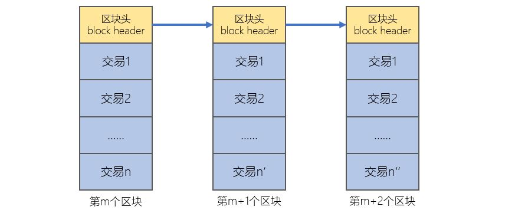

[《Python应用实战》视频课程](https://study.163.com/course/courseMain.htm?courseId=1209533804&share=2&shareId=400000000624093)

# 比特币交易费用

难度：★★★☆☆

## 区块链与挖矿

区块链：比特币的账本

挖矿：在区块链上增加新的区块




- 通常一个交易被某个区块所包含，才认为此交易被确认了
- 产生新的区块是一个大工作量的事
- 一个区块中包含的所有交易的交易费用，归产生这个区块的矿工所有

*后面的课程中，会有对区块链和挖矿在更宏观角度的认识，以及更微观层面上的操作演示*

## 交易费用的逻辑

- 交易费用由交易者自由确定
- 交易费用越高，交易被确认的速度越快
- 交易费用 = 交易信息长度 * 单位长度价格

## 当前交易价格与交易确认速度之间的关系

[https://bitcoinfees.earn.com/](https://bitcoinfees.earn.com/)

## bit库中的交易价格

```python
from bit.network import fees

# 获得最快被交易（0-1个区块）的最低价格
fees.get_fee()

# 获得在1小时之内被交易的最低价格
fees.get_fee(fast=False)

# 缺省使用fees.get_fee()获得的价格
keyA.send([(keyA.address,100,'satoshi')])

# 指定单位字节的价格
keyA.send([(keyA.address,100,'satoshi')], fee=50)

# 指定本交易的总价格
keyA.send([(keyA.address,100,'satoshi')], fee=250, absolute_fee=True)

```


## 概念词汇

- `blockchain`

  block，块，区块；chain，链；blockchain区块链

- `mine`

  挖矿；miner，挖矿者，矿工

- `miner fee`

  区块中的交易费用，由生成本区块的挖矿者获得

- `block subsidy`

  区块补贴，生成本区块的挖矿者获得的收益
