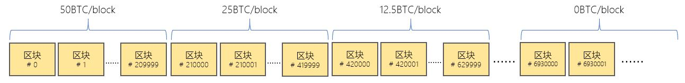
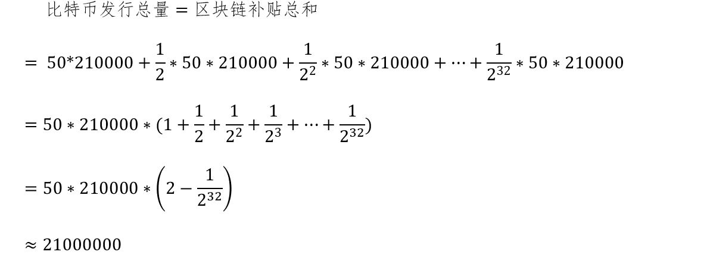

[《Python应用实战》视频课程](https://study.163.com/course/courseMain.htm?courseId=1209533804&share=2&shareId=400000000624093)

# 比特币发行

难度：★★☆☆☆

## 用户使用小结

- 账户无需注册，匿名生成
- 账务公开
- 交易确认有延时
- 可以支付交易费用

*比特币在用户使用体验上有自己的特性，但这不是比特币与主流货币的本质差别*

## 比特币的发行

#### 区块补贴是比特币发行的唯一途径

  每个区块的区块补贴由生成这个区块的账户获得

#### 区块补贴规则

- 第一个区块的区块补贴是50比特币
- 每210,000个区块后，区块补贴减半
- 在第6,930,000个区块后，没有区块补贴

#### 比特币发行总量计算

#### 发行量估算

*平均每10分钟产生一个新的区块*

|时间|发行量/每区块|发行量/天|发行量/每年|
| :----- | :----- | :----- | :----- |
|2009年-2012年|50btc|7200btc|2,628,000btc|
|2013年-2016年|25btc|3600btc|1,314,000btc|
|2017年-2020年|12.5btc|1800btc|657,000btc|
|2021年-2024年|6.26btc|900btc|328,500btc|
|……|……|……|……|
|2137年-2140|0.00000001btc|0.0000017btc|0.00061btc|
|2141年-|0btc|0btc|0btc|

## 比特币区块链信息

- [https://www.blockchain.com/explorer](https://www.blockchain.com/explorer)
- [https://blockexplorer.com/](https://blockexplorer.com/)
- [https://insight.bitpay.com/](https://insight.bitpay.com/)
- [https://smartbit.com.au](https://smartbit.com.au)

## 两个最基础的问题

- 为什么要遵循这些规则？

  *遵循规则的唯一原因，是因为有很多（或者预期将来会有很多）其它人相信遵循这些规则产生的比特币是有价值的，仅此而已*

- 比特币有价值吗？

  我对以下观点的看法：

    + *“比特币空无一物，一文不值”*

    + *“比特币会成为主流货币”*

    + *“我也可以创造新的货币”（发币者）*
