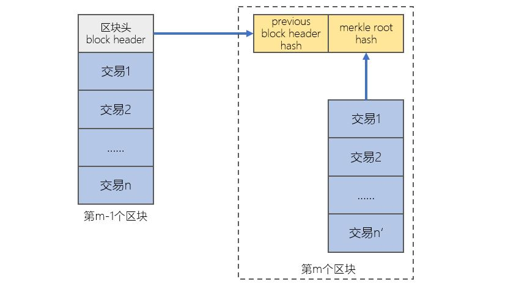
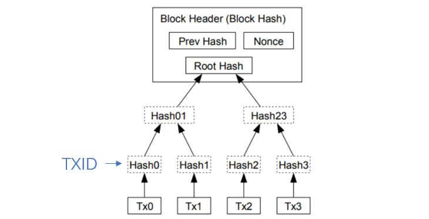
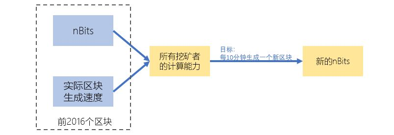

[《Python应用实战》视频课程](https://study.163.com/course/courseMain.htm?courseId=1209533804&share=2&shareId=400000000624093)

# 区块链结构分析

难度：★★★★☆

## 区块链结构


## 区块头结构

*区块头一共80字节，6个字段*

|字节数|类型|名字|描述|
|:------:|:------:|:------|:------|
|4|int32_t|version|区块的版本号|
|32|char[32]|previous block header hash|前一个区块的区块头的双重HASH值，HASH函数：SHA256(SHA256())|
|32|char[32]|merkle root hash|Merkle可信树的根HASH，HASH函数：SHA256(SHA256())|
|4|uint32_t|time|区块产生的时间，时间戳类型|
|4|uint32_t|nBits|目标门槛值的表达|
|4|uint32_t|nonce|一个挖矿者需要产生的数字|

```python
import struct

blockheader100000 = b'\x01\x00\x00\x00P\x12\x01\x19\x17*a\x04!\xa6\xc3\x01\x1d\xd30\xd9\xdf\x07\xb66\x16\xc2\xcc\x1f\x1c\xd0\x02\x00\x00\x00\x00\x00fW\xa9%*\xac\xd5\xc0\xb2\x94\t\x96\xec\xff\x95"(\xc3\x06|\xc3\x8dH\x85\xef\xb5\xa4\xacBG\xe9\xf37"\x1bML\x86\x04\x1b\x0f+W\x10'
blockheader100001 = b"\x01\x00\x00\x00\x06\xe53\xfd\x1a\xda\x869\x1f?l42\x04\xb0\xd2x\xd4\xaa\xec\x1c\x0b \xaa'\xba\x03\x00\x00\x00\x00\x00j\xbb\xb3\xeb=s:\x9f\xe1\x89g\xfd}L\x11~L\xcb\xba\xc5\xbe\xc4\xd9\x10\xd9\x00\xb3\xae\x07\x93\xe7\x7fT$\x1bML\x86\x04\x1b@\x89\xcc\x9b"
blockheader100002 = b'\x01\x00\x00\x00\x90\xf0\xa9\xf1\x10p/\x80\x82\x19\xeb\xea\x11s\x05`B\xa7\x14\xba\xd5\x1b\x91l\xb6\x80\x00\x00\x00\x00\x00\x00Ru(\x95X\xf5\x1c\x99fi\x94\x04\xae"\x94s\x0c<\x9f\x9b\xdaSR<\xe5\x0e\x9b\x95\xe5X\xda/\xdb&\x1bML\x86\x04\x1b\x1a\xb1\xbf\x93'

(ver100000, 
 pre_hash100000,
 merkel_root100000,
 timestamp100000,
 nbits100000,
 nonce100000) = struct.unpack('<i32s32s3I', blockheader100000)

(ver100001, 
 pre_hash100001,
 merkel_root100001,
 timestamp100001,
 nbits100001,
 nonce100001) = struct.unpack('<i32s32s3I', blockheader100001)

(ver100002, 
 pre_hash100002,
 merkel_root100002,
 timestamp100002,
 nbits100002,
 nonce100002) = struct.unpack('<i32s32s3I', blockheader100002)

# 从timestamp转换为datetime
import datetime
datetime.datetime.fromtimestamp(timestamp100000)
datetime.datetime.fromtimestamp(timestamp100001)
datetime.datetime.fromtimestamp(timestamp100002)
```

[struct库参考文档](https://docs.python.org/3/library/struct.html)


## 'previous block header hash'与'merkle root hash'



```python
import hashlib

def doublesha(input):
    h = hashlib.sha256(input).digest()
    return hashlib.sha256(h).digest()

# 区块头中包含的previous block header hash，与上个区块头实际计算值相等
pre_hash100001 == doublesha(blockheader100000)
pre_hash100002 == doublesha(blockheader100001)
```


## nBits与nonce

*一个合法的区块，它的区块头的HASH值，必须小于nBits所代表的目标门槛值。*

- 从nBits转换为目标门槛值

```python
# 从nBits转换为目标门槛值（target threshold）
def nbits2target(nbits):
    v = nbits&0x00ffffff
    m = (((nbits&0xff000000) >> 24) -3)*8
    return v<<m

nbits2target(nbits100000)
nbits2target(nbits100001)
nbits2target(nbits100002)

# difficulty
nbits2target(0x1d00ffff)/nbits2target(nbits100000)
nbits2target(0x1d00ffff)/nbits2target(nbits100001)
nbits2target(0x1d00ffff)/nbits2target(nbits100002)
```

- 每个区块头需要满足的条件

  *挖矿：不断调整区块头中的nonce，使区块头的HASH值，小于nBits所代表的目标门槛值。*

```python
# 搜索nonce，需要达到的条件
int.from_bytes(doublesha(blockheader100000),'little') < nbits2target(nbits100000)
int.from_bytes(doublesha(blockheader100001),'little') < nbits2target(nbits100001)
int.from_bytes(doublesha(blockheader100002),'little') < nbits2target(nbits100002)
```

- 难度的量化计算

```python
# 需要尝试的次数估计
2**256/nbits2target(nbits100000)

# 实际的比特币网络（所有挖矿者）的计算力
2**256/nbits2target(nbits100000)/区块实际花费的时间

```

- nBits值的调整



- 每2016个区块，使用一个新的nBits
- 此nBits根据前2016个区块的实际数据生成
- 计算能力与前2016个区块相同的情况下，每个区块生成时间的估计值为10分钟

## 概念词汇

- `header`

  信息头

- `previous block header hash`

  比特币区块链区块头中的一个信息字段，用于保证本区块是上个区块的延续

- `merkle root hash`

  比特币区块链区块头中的一个信息字段，用于保持头部与本区块中交易信息的一致性

- `nBits`

  比特币区块链区块头中的一个信息字段，nBits与本区块生成的难度是完全相关的

- `nonce`

  比特币区块链区块头中的一个信息字段，挖矿者不断尝试变化的一个字段，尝试的目的是使本区块符合规则

- `target threshold`

  目标门槛值；从nBits计算得到的目标值，比特币区块的一个重要规则是：区块头的HASH值小于此target threshold
