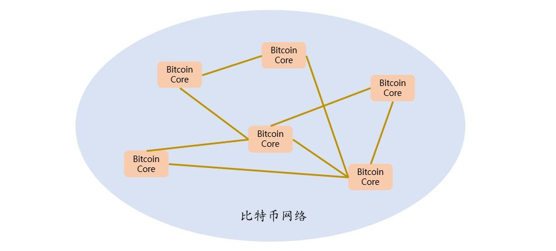

[《Python应用实战》视频课程](https://study.163.com/course/courseMain.htm?courseId=1209533804&share=2&shareId=400000000624093)

# Bitcoin Core

难度：★★★☆☆

## 比特币网络与Bitcoin Core

- 比特币网络是运行在加密协议上的P2P支付网络

- 比特币网络的架构模式是[P2P](https://en.wikipedia.org/wiki/Peer-to-peer)，其中每个节点上运行的软件是[Bitcoin Core](https://bitcoincore.org/)

## Bitcoin Core基础信息

- 免费、开源（[github站点](https://github.com/bitcoin/bitcoin)）
- C++程序
- 支持Windows、Linux、MacOS等多种操作系统
- 最初的软件称为Bitcoin，由中本聪在2009年发布

## 安装与使用

- [下载](https://bitcoin.org/en/download)对应的版本
- 解压缩

  `tar -xzvf bitcoin-0.xx.x-…….tar.gz`

- 命令运行

    + `bitcoind`

      比特币网络节点后台程序（命令行）

    + `bitcoin-cli`

      向`bitcoind`发送RPC请求的客户端（命令行）

      

    + `bitcoin-qt`

      比特币网络节点程序（图形化）

- 数据存储目录

  `~/.bitcoin/`

## 功能

- 与其它网络节点通讯，同步信息

  + 获得区块链信息，以及交易信息
  + 本地保存区块链完整副本

- 发送本地信息给其它网络节点

  + 区块链
  + 交易信息

- RPC接口

  + 提供远程过程调用接口
  + 基于http协议与json格式
  + 服务端口号8332

- 为挖矿提供服务

  + 提供组装新区块需要的原始信息
  + 发送新区块

    

- 比特币钱包

  + 生成（导入）比特币账户
  + 查询账户余额
  + 发起交易

#### 附：比特币钱包的几种实现策略

|序号|实现方式|优点|缺点|安全性|本地资源消耗|操作方便性|
|-------|-------|-------|-------|-------|-------|-------|
|1|比特币账户密钥保存在本地，使用本地的bitcoind RPC接口（相当于直接使用本地bitcoin core中的钱包）|不经过中间节点，直接接入比特币网络，更安全|bitcoind运行需要耗费比较多的资源|高|高|差|
|2|比特币账户密钥保存在本地，使用第三方的接口发送查询与交易请求|本地资源消耗小|第三方可以通过分析你的请求，掌握你的资金流动情况|中|低|差|
|3|比特币账户密钥托管给第三方|可以直接使用浏览器操作账户|一旦第三方发生安全问题，你的比特币就很有可能再也找不回来了|低|无|好|

## 概念词汇

- `P2P`

  Peer to Peer，点对点，一种分布式、去中心化的架构

- `Decentralized`

  去中心化的

- `bitcoin core`

  比特币核心，一个运行在比特币网络节点上的软件

- `RPC`

  Remote Procedure Call，远程过程调用

- `wallet`

  钱包；bitcoin wallet，比特币钱包
