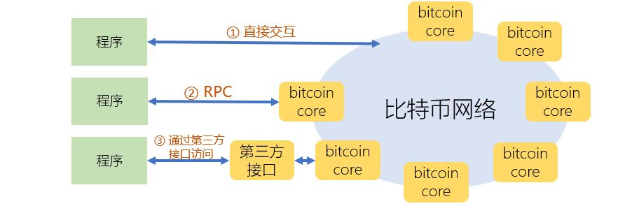

[《Python应用实战》视频课程](https://study.163.com/course/courseMain.htm?courseId=1209533804&share=2&shareId=400000000624093)

# Bitcoin Core's RPCs

难度：★★★☆☆

## 访问比特币网络的三种途径



- 直接使用比特币网络的协议进行交互
- 使用`bitcoin core`提供的RPC接口
- 使用第三方基于`bitcoin core` RPC接口包装的接口
    + [blockchain](https://www.blockchain.com/zh-cn/api)
    + [smartbit](https://www.smartbit.com.au/api)
    + [bitpay](https://bitpay.com/docs/)

## RPC使用

#### 准备：启动`bitcoind`程序

  `./bitcoin-0.18.1/bin/bitcoind -rpcuser=pi -rpcpassword=hachina -daemon`

  *如果数据同步没有完成，会有部分功能无法使用*

#### 直接编写Python程序

```python
import requests

def rpcCall(method, params = None, port=8332, host="localhost", user="user", password="password"):
    
    # 准备HTTP请求
    headers = {'content-type': 'application/json'}
    url = "http://" + host + ":" + str(port)
    payload = {"method": method, "params": params, "jsonrpc": "2.0", "id": 1}
    
    # 发送HTTP请求
    r = requests.post(url, json=payload, headers=headers, auth=(user, password))
    
    # 解析返回结果
    json = r.json()
    if 'result' in json and json['result'] != None:
        return json['result']
    elif 'error' in json and json['error'] != None:
        raise ConnectionError("Request failed with RPC error", json['error'])
    if r.status_code != 200:
        raise ConnectionError("Request failed with HTTP status code ", r.status_code)
    return

# 获得本地区块链的长度
rpcCall('getblockcount', user='pi', password='hachina')

# 获得某个高度区块的HASH值
rpcCall('getblockhash', [364697], user='pi', password='hachina')

# 获得某个HASH值的区块的信息（JSON）
rpcCall('getblock', ['00000000000000000c113f13537c0a15d32b8d708cd7c0a34b89ed9bed484a1e'], user='pi', password='hachina')

# 获得某个HASH值的区块的信息（十六进制表达）
rpcCall('getblock', ['00000000000000000c113f13537c0a15d32b8d708cd7c0a34b89ed9bed484a1e',0], user='pi', password='hachina')

```

#### 使用[python-bitcoinrpc](https://github.com/jgarzik/python-bitcoinrpc)库

- 安装

  `pip install python-bitcoinrpc` 

- 使用

```python
RPC_USER = 'pi'
RPC_PASSWORD = 'hachina'

from bitcoinrpc.authproxy import AuthServiceProxy, JSONRPCException

rpc_connection = AuthServiceProxy("http://%s:%s@127.0.0.1:8332"%(RPC_USER, RPC_PASSWORD))

# bitcoind内存使用情况
rpc_connection.getmemoryinfo()

# 区块链长度
rpc_connection.getblockcount()

# 区块HASH值
rpc_connection.getblockhash(345678)

# 区块内容（json）
rpc_connection.getblock('00000000000000000c113f13537c0a15d32b8d708cd7c0a34b89ed9bed484a1e')

# 区块内容（raw）
rpc_connection.getblock('00000000000000000c113f13537c0a15d32b8d708cd7c0a34b89ed9bed484a1e', 0)
```

## RPC接口概览

[参考文档](https://bitcoin.org/en/developer-reference#rpc-quick-reference)

- 监控`bitcoind`程序的运行

  获得bitcoind程序的配置与运行状态信息，停止bitcoind运行

- 网络

  监视与控制bitcoind与比特币网络的交互

- 区块链信息

  获得区块链与具体区块的信息，获得交易池的信息

- 交易信息

  交易信息的获取、组装等

- 比特币钱包

  钱包操作（账户管理、查询、交易）的调用接口
  
- 挖矿

  给挖矿者提供的服务接口

## 挖矿

- 使用getwork接口（已过时）

  [pyminer演示程序](https://github.com/jgarzik/pyminer)

- 使用getblocktemplate接口


  [Christian的bitcoin项目](https://github.com/christianb93/bitcoin)

  操作：

  *如果系统中没有matplotlib库，需要先安装：`pip install matplotlib`*

  *如果系统中没有ecdsa库，需要先安装：`pip install ecdsa`*

  1. `git clone https://github.com/christianb93/bitcoin`

  2. 修改`Miner.py`中几处`btc.utils.rpcCall`调用

     在参数中增加：`user='pi', password='hachina', port=8332`

  3. 运行`python Miner.py --target 12qz4MsEtyfoVVRKwSsv48fx3YYMZ2i7Mu`


