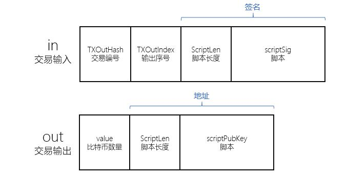
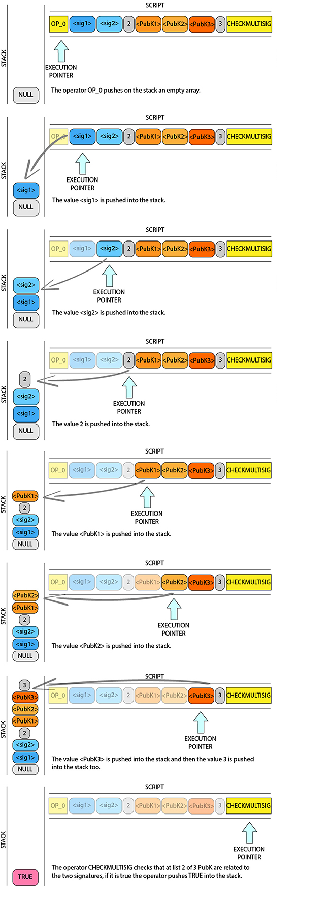
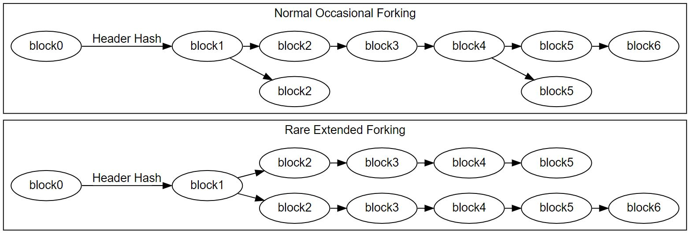
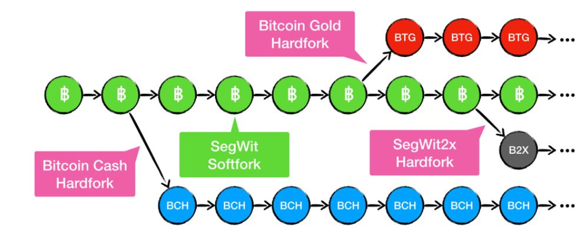
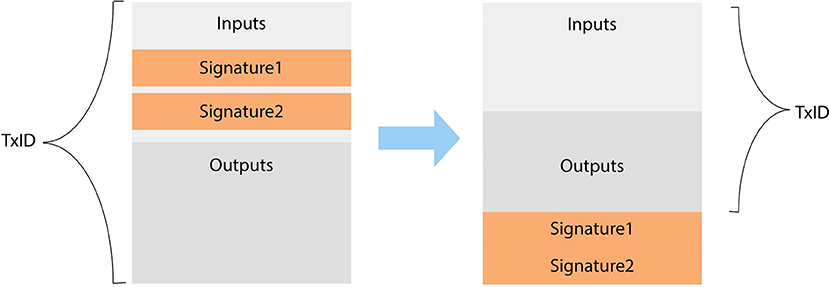

[《Python应用实战》视频课程](https://study.163.com/course/courseMain.htm?courseId=1209533804&share=2&shareId=400000000624093)

# Script、CoinBase、分叉及其它

难度：★★★★★

## Script

在交易信息中，out中的目标地址，以及in中的签名，其实都是脚本。

几种典型的脚本：

- Pay-to-PubkeyHash(地址类型`0x00`)

  *（out）scriptPubKey：*  `OP_DUP OP_HASH160 <pubKeyHash> OP_EQUALVERIFY OP_CHECKSIG`

  *（in）scriptSig：*  `<sig> <pubKey>`

|步骤|堆栈|脚本|描述|
|--------|:--------|:--------|:--------|
|1| 空 | `<sig> <pubKey> OP_DUP OP_HASH160 <pubKeyHash> OP_EQUALVERIFY OP_CHECKSIG` |将对应的scriptSig和scriptPubKey连接成一段脚本|
|2| `<sig> <pubKey>` | `OP_DUP OP_HASH160 <pubKeyHash> OP_EQUALVERIFY OP_CHECKSIG` |脚本开始执行，头部内容放入堆栈|
|3| `<sig> <pubKey> <pubKey>` | `OP_HASH160 <pubKeyHash> OP_EQUALVERIFY OP_CHECKSIG` | 执行OP_DUP，复制堆栈头部信息 |
|4| `<sig> <pubKey> <pubHashA>` | `<pubKeyHash> OP_EQUALVERIFY OP_CHECKSIG` | 执行OP_HASH160，堆栈头部信息被HASH|
|5| `<sig> <pubKey> <pubHashA> <pubKeyHash>` | `OP_EQUALVERIFY OP_CHECKSIG` | 内容加入堆栈 |
|6| `<sig> <pubKey>` | `OP_CHECKSIG` | 执行OP_EQUALVERIFY，判断`in`中的`publickey`是否与`out`中的`publickey`一致 |
|7|true| 空 |  执行OP_CHECKSIG，判断签名值是否一致 |

- Pay-to-Script-Hash(地址类型`0x05`)

  *（out）scriptPubKey：*  `OP_HASH160 <scriptHash> OP_EQUAL`

  *（in）scriptSig：*  `..signatures... <serialized script>`

  *典型应用：多人共享账户*

    *注：下面图中的脚本，仅对应scriptSig部分；由scriptPubKey部分，保证其中的`<serialized script>`(也就是`2 <PubK1> <PubK2> <PubK3> 3 OP_CHECKMULTISIG`)的确定性*

   

参考：

[https://en.bitcoin.it/wiki/Script](https://en.bitcoin.it/wiki/Script)

## coinbase

- coinbase transaction是每个区块中第一笔交易
- coinbase transaction的输入中的交易号为全零，输出序号为全F（0xffffffff）
- coinbase中scriptSig可以包含任意字符

在genesis block（#0 block）中，中本聪留下了以下的话：

*The Times 03/Jan/2009 Chancellor on brink of second bailout for banks*

*（财政大臣正处于实施第二轮银行紧急援助的边缘）*

## extra-nonce

- 当前新区块的生成难度非常大，往往遍历整个头部的nonce都不能找到符合规定的新区块
- 这时候，可以变更coinbase transaction中的scriptSig，有时候将此称为extra-nonce
- 当变化extra-nonce后，因为改变了交易数据，因此需要重新计算头部的Merkle root hash

## 区块链分叉

#### 临时分叉（regular fork）

- 大家还是在相同的共识下挖矿
- 由于比特币网络不完全同步造成的
- 会很快自然消失

#### 软分叉（soft fork）

- 软分叉是由于协议（共识）升级造成的
- 当所有节点版本升级后，分叉会消失

#### 硬分叉（hard fork）

- 硬分叉是永久性分叉
- 节点对协议（共识）产生了分歧
- 硬分叉生成新的货币

## SegWit

- Segregated Witness的缩写
- 在区块中，将UTXO与签名信息分开存放，并在计算TxID时（以及由TxID计算Merkle root hash时），不将签名信息计算在内
- 一个非对称加密算法的密钥，可以同时对应PublibKeyHash类型的地址与SegWit类型的地址
- 使用SegWit类型的地址，能有效降低交易费用（签名信息只算1/4长度）

## 以太坊（Ethereum）与智能合约

- 以太坊也是开源、去中心化、基于区块链的平台
- 以太坊产生的虚拟货币是以太币
- 相比于比特币区块链中的Script，以太坊引入了更完备的语言，用于生成更丰富的智能合约
