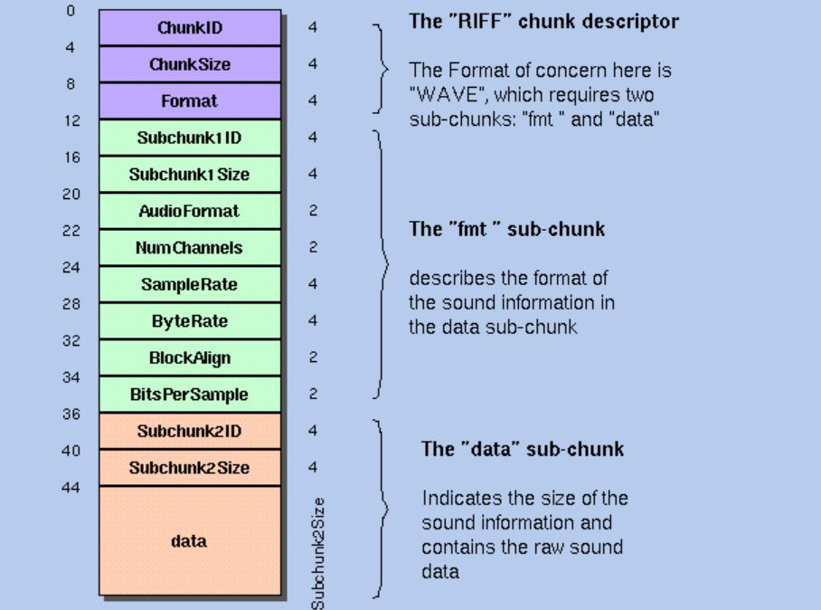

[《Python应用实战》视频课程](https://study.163.com/course/courseMain.htm?courseId=1209533804&share=2&shareId=400000000624093)

# Wave文件读写

难度：★★☆☆☆

## RIFF与PCM

- RIFF

  [Resource Interchange File Format](https://en.wikipedia.org/wiki/Resource_Interchange_File_Format)

  RIFF是一种文件架构格式，组成文件的是若干个chunk。

  

- PCM

  [Pulse-code modulation](https://en.wikipedia.org/wiki/Pulse-code_modulation)

  PCM是音频信号的一种最简单的编码格式。在上个视频中从音频设备输入与输出的数据，就是PCM编码格式的。

  

## Wave文件

  - 用于存放音频内容
  - 使用RIFF文件格式
  - 音频信号的数字编码采用PCM
  - 文件后缀一般是`.wav`

  

## Python中的wave库

  [官方文档](https://docs.python.org/zh-cn/3/library/wave.html)

- 播放wave文件

  样例程序：[wave2play.py](programs/wave2play.py)

  功能：使用缺省的声音播放设备，播放wave文件

  播放的样例wav文件：[example0.wav](https://github.com/zhujisheng/learn_python/raw/master/08.%E7%A7%91%E5%AD%A6%E8%AE%A1%E7%AE%97%E4%B8%8E%E4%BD%9C%E5%9B%BE/programs/example0.wav)

- 录音

  样例程序：[record2wave.py](programs/record2wave.py)

  功能：使用缺省的声音录制设备进行录音，存放在wave格式文件中

  
## 概念词汇

- `wave`

  声音存放为文件的一种存放格式

- `RIFF`

  Resource Interchange File Format

- `PCM`

  Pulse-code modulation
