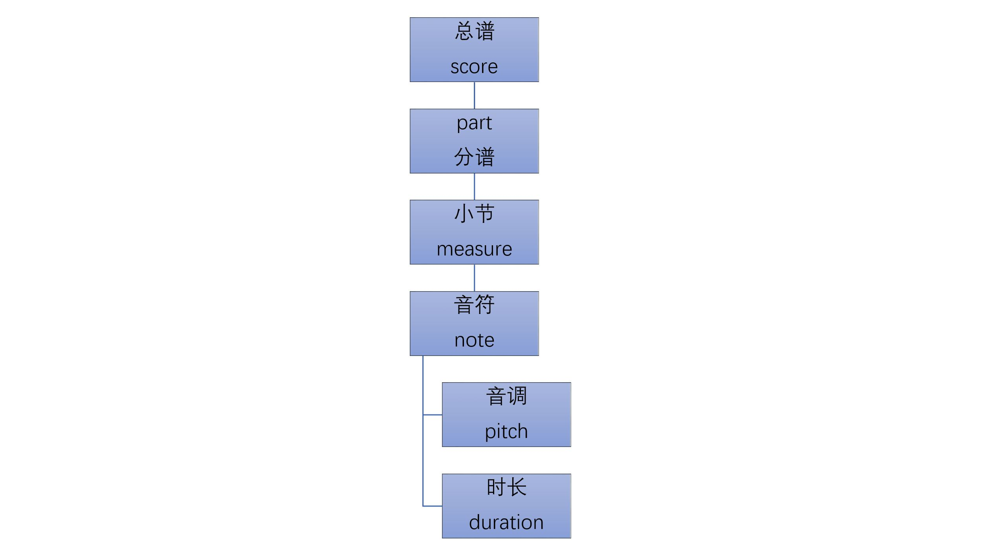

[《Python应用实战》视频课程](https://study.163.com/course/courseMain.htm?courseId=1209533804&share=2&shareId=400000000624093)

# music21库

难度：★★★☆☆

## 基础概述

- music21是计算机辅助音乐工具包

  librosa用于音乐或音频的分析，适合于需要完成音频相关工作的程序员；
  
  music21适合于需要使用电脑完成工作的音乐工作者
  
- 官方文档：[https://web.mit.edu/music21/doc/index.html](https://web.mit.edu/music21/doc/index.html)

- 安装

  `pip install music21`

- 引入`music21`、查看配置文件

  ```python
  from music21 import *
  us = environment.UserSettings()
  
  ################
  # 创建配置文件 #
  ###############
  us.create()

  ###################
  # 获得配置文件位置 #
  ##################
  us.getSettingsPath()
  ```

## 音乐内容的输入

- 支持的音乐内容格式

  ```python
  converter.Converter().subconvertersList('input')
  ```

  *注：一定要理解音乐文件与音频文件的区别*

- 从文件中读入

  ```python
  a = converter.parse('audio/mysong.mid')
  ```

- 从INTERNET中读入

  ```python
  url = 'http://kern.ccarh.org/cgi-bin/ksdata?l=cc/bach/cello&file=bwv1007-01.krn&f=xml'
  b = converter.parse(url)
  ```

  *注：要从INTERNET下载内容，必须修改配置文件中`autoDownload`项为`allow`*

  ```xml
  <preference name="autoDownload" value="allow" />
  ```

- 从music21附带的音乐库中读入

  ```python
  c = corpus.parse('bach/bwv57.8')
  ```

  *音乐库中的内容：[https://web.mit.edu/music21/doc/about/referenceCorpus.html](https://web.mit.edu/music21/doc/about/referenceCorpus.html)*


## 音乐内容的输出

- 支持的音乐内容格式

  ```python
  converter.Converter().subconvertersList('output')
  ```

- 保存为musicxml格式

  ```python
  a.write('musicxml', 'audio/mysong.mxl')
  ```

- 保存为midi格式文件

  ```python
  b.write('midi', 'audio/chopin.mid')
  ```

- 直接midi播放

  ```python
  c.show('midi')
  ```

- 五线谱

  如果需要五线谱的展现，一般会安装[musescore](https://musescore.org/)

  linux下安装：`sudo apt-get install musescore`

  修改配置项`musicxmlPath`，指向`musescore`执行文件：

  ```xml
  <preference name="musicxmlPath" value="C:\MuseScore\bin\MuseScore3.exe" />
  ```

  ```python
  c.show('musicxml')
  ```

## 音乐内容结构

- 递归打印

  ```python
  for el in c.recurse():
      print(el.offset, el, el.activeSite)
  ```

- 以text形式输出

  ```python
  c.show('text')
  ```

- 大致的结构



- 访问结构中的部分元素

  - `c.parts[0]`：第一个分谱

  - `c.parts[0].measures(2,4)`：第一个分谱的2到4小节

  - `c.parts[0].measure(2).notes[0]`：第一分谱的2小节的第一个音符
  
  - `c.parts[0].measure(2).notes[0].pitch`：第一分谱的2小节的第一个音符的音高
  
  - `c.parts[0].measure(2).notes[0].duration`：第一分谱的2小节的第一个音符的时长
