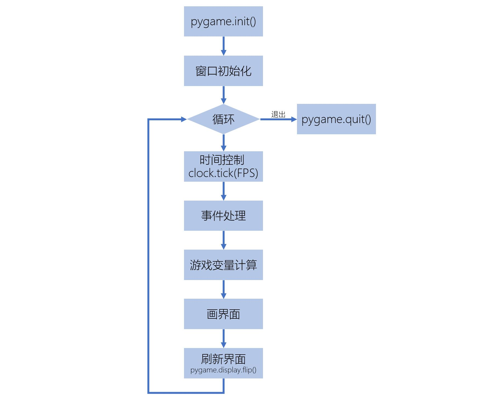

[《Python应用实战》视频课程](https://study.163.com/course/courseMain.htm?courseId=1209533804&share=2&shareId=400000000624093)

# pygame库与游戏流程框架

难度：★★★☆☆

## PyGame库

- PyGame官网：[https://www.pygame.org/](https://www.pygame.org/)

- [Arcade](https://arcade.academy/index.html) 

## Bouncing Ball Game

[游戏代码 bouncing_ball.py](programs/bouncing_ball.py)

几个资源文件：
- [ball.png](programs/ball.png)
- [blood_red_bar.png](programs/blood_red_bar.png)
- [background.mp3](programs/background.mp3)
- [ball.wav](programs/ball.wav)


## 程序流程框架



```python
# Pygame 程序框架
import pygame

# 定义窗口属性
W_NAME = "Bouncing Ball Game"
W_WIDTH = 1024
W_HEIGHT = 720
W_FPS = 30

# 定义颜色
BLACK = (0, 0, 0)

# 初始化
pygame.init()
screen = pygame.display.set_mode((W_WIDTH, W_HEIGHT))
pygame.display.set_caption(W_NAME)
clock = pygame.time.Clock()

# 游戏主循环
running = True
while running:
    # 保持刷新速度
    clock.tick(W_FPS)

    # 处理输入（事件）
    for event in pygame.event.get():
        if event.type == pygame.QUIT:
            running = False

    # 更新游戏变量

    # 画界面
    screen.fill(BLACK)

    # 刷新界面
    pygame.display.flip()

# 退出
pygame.quit()
```