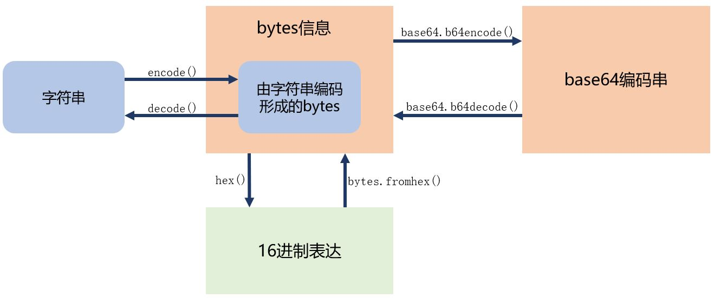
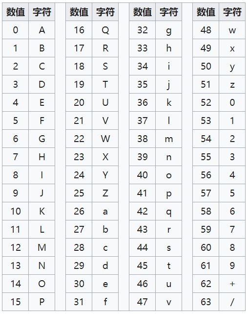
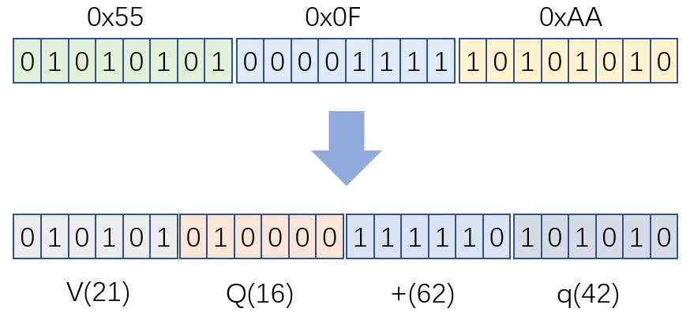

# bytes数据的文字表达与Base64编码

难度：★★☆☆☆

## 什么是`bytes`的文字表达

- 计算机系统中，最终存储与网络传输的，都是`bytes`
- 很多时候，我们需要文字，而不是二进制数据
- 最简单的文字表达方式，是将原始数据以x进制写出来
- base64编码是一种更经济的原始数据（二进制数据）的表达方式

## base64编码的基本原理

- base64编码表

- base64计算过程

- 编码后的信息长度是编码前的4/3倍

*如果传入的字节数不是3的倍数，就用0将它补齐；同时在输出时，补齐的零映射为字符`=`*

## base64库

- 编码
  - `base64.standard_b64encode(s)`
  - `base64.b64encode(s, altchars=None)`

- 解码
  + `base64.standard_b64decode(s)`
  + `base64.b64decode(s, altchars=None, validate=False)`

[base64库官方文档](https://docs.python.org/3/library/base64.html)

## 核心词汇

- `binary`

  二进制数据

- `hex`

  十六进制

- `base64`

  一种将二进制数据转化为人类可阅读字符的编码方式

- `validate`

  验证正确性